# Muse VCS — Type Contracts Reference

> Updated: 2026-03-18 (v0.1.2) | Reflects every named entity in the Muse VCS surface.
> `Any` and `object` do not exist in any production file. Every type boundary
> is named. The typing audit ratchet enforces zero violations on every CI run.

This document is the single source of truth for every named entity —
`TypedDict`, `dataclass`, `Protocol`, `Enum`, `TypeAlias` — in the Muse
codebase. It covers the full contract of each type: fields, types,
optionality, and intended use.

---

## Table of Contents

1. [Design Philosophy](#design-philosophy)
2. [Domain Protocol Types (`muse/domain.py`)](#domain-protocol-types)
   - [Type Aliases](#type-aliases)
   - [Operation TypedDicts — DomainOp variants](#operation-typeddicts)
   - [Snapshot and Delta TypedDicts](#snapshot-and-delta-typeddicts)
   - [Result Dataclasses](#result-dataclasses)
   - [MuseDomainPlugin Protocol](#musedomainplugin-protocol)
   - [Optional Protocol Extensions](#optional-protocol-extensions)
3. [Domain Schema Types (`muse/core/schema.py`)](#domain-schema-types)
4. [Diff Algorithm Types (`muse/core/diff_algorithms/`)](#diff-algorithm-types)
5. [OT Merge Types (`muse/core/op_transform.py`)](#ot-merge-types)
6. [Op Log Types (`muse/core/op_log.py`)](#op-log-types)
7. [CRDT Primitive Types (`muse/core/crdts/`)](#crdt-primitive-types)
8. [Store Types (`muse/core/store.py`)](#store-types)
9. [Merge Engine Types (`muse/core/merge_engine.py`)](#merge-engine-types)
10. [Attributes Types (`muse/core/attributes.py`)](#attributes-types)
11. [MIDI Dimension Merge Types (`muse/plugins/midi/midi_merge.py`)](#midi-dimension-merge-types)
12. [Code Plugin Types (`muse/plugins/code/`)](#code-plugin-types)
13. [Configuration Types (`muse/cli/config.py`)](#configuration-types)
14. [MIDI / MusicXML Import Types (`muse/cli/midi_parser.py`)](#midi--musicxml-import-types)
15. [Stash Types (`muse/cli/commands/stash.py`)](#stash-types)
16. [Error Hierarchy (`muse/core/errors.py`)](#error-hierarchy)
17. [Entity Hierarchy](#entity-hierarchy)
18. [Entity Graphs (Mermaid)](#entity-graphs-mermaid)

---

## Design Philosophy

Every entity in this codebase follows five rules:

1. **No `Any`. No `object`. Ever.** Both collapse type safety for downstream
   callers. Every boundary is typed with a concrete named entity — `TypedDict`,
   `dataclass`, `Protocol`, or a specific union. The CI typing audit enforces
   this with a ratchet of zero violations.

2. **No covariance in collection aliases.** `dict[str, str]` and
   `list[str]` are used directly. If a function's return mixes value types,
   create a `TypedDict` for that shape instead of using `dict[str, str | int]`.

3. **Boundaries own coercion.** When external data arrives (JSON from disk,
   TOML from config, MIDI bytes from disk), the boundary module coerces it
   to the canonical internal type using `isinstance` narrowing. Downstream
   code always sees clean types.

4. **Wire-format TypedDicts for serialisation, dataclasses for in-memory
   logic.** `CommitDict`, `SnapshotDict`, `TagDict` are JSON-serialisable
   and used by `to_dict()` / `from_dict()`. `CommitRecord`, `SnapshotRecord`,
   `TagRecord` are rich dataclasses with typed `datetime` fields used in
   business logic.

5. **The plugin protocol is the extension point.** All domain-specific logic
   lives behind `MuseDomainPlugin`. The core DAG engine, branching, and
   merge machinery know nothing about music, genomics, or any other domain.
   Swapping domains is a one-file operation.

### Banned → replacement table

| Banned | Use instead |
|--------|-------------|
| `Any` | `TypedDict`, `dataclass`, specific union |
| `object` | The actual type or a constrained union |
| `list` (bare) | `list[X]` with concrete element type |
| `dict` (bare) | `dict[K, V]` with concrete key/value types |
| `dict[str, X]` with known keys | `TypedDict` — name the keys |
| `Optional[X]` | `X \| None` |
| Legacy `List`, `Dict`, `Set`, `Tuple` | Lowercase builtins |
| `cast(T, x)` | Fix the callee to return `T` |
| `# type: ignore` | Fix the underlying type error |

---

## Domain Protocol Types

**Path:** `muse/domain.py`

The six-interface contract that every domain plugin must satisfy. The core
engine implements the DAG, branching, merge-base finding, and lineage walking.
A domain plugin provides the six methods and gets the full VCS for free.
Two optional protocol extensions (`StructuredMergePlugin`, `CRDTPlugin`) unlock
richer merge semantics.

### Type Aliases

| Alias | Definition | Description |
|-------|-----------|-------------|
| `DomainAddress` | `str` | Stable human-readable address of an element within the domain namespace (e.g. `"note:4:60"` in MIDI, `"src/mod.py#Foo.bar"` in code) |
| `SemVerBump` | `Literal["major", "minor", "patch", "none"]` | Semantic version impact of a delta |
| `LeafDomainOp` | `InsertOp \| DeleteOp \| MoveOp \| ReplaceOp \| MutateOp` | All non-recursive operation variants |
| `DomainOp` | `LeafDomainOp \| PatchOp` | The complete discriminated union; `PatchOp.child_ops` is `list[DomainOp]` (recursive) |
| `LiveState` | `SnapshotManifest \| pathlib.Path` | Current domain state — either an in-memory snapshot or the `muse-work/` directory path |
| `StateSnapshot` | `SnapshotManifest` | A content-addressed, immutable capture of state at a point in time |
| `StateDelta` | `StructuredDelta` | The typed delta between two snapshots |

### Operation TypedDicts

Every `DomainOp` variant is a `TypedDict` with an `op` discriminator and an
`address` identifying the element within the domain's namespace.

#### `InsertOp`

`TypedDict` — Add a new element.

| Field | Type | Description |
|-------|------|-------------|
| `op` | `Literal["insert"]` | Discriminator |
| `address` | `DomainAddress` | Stable address of the new element |
| `position` | `int \| None` | Insertion position; `None` for unordered collections |
| `content_id` | `str` | SHA-256 of the inserted element's serialised content |
| `content_summary` | `str` | Human-readable one-liner for display |

#### `DeleteOp`

`TypedDict` — Remove an existing element.

| Field | Type | Description |
|-------|------|-------------|
| `op` | `Literal["delete"]` | Discriminator |
| `address` | `DomainAddress` | Address of the element being removed |
| `position` | `int \| None` | Position at time of deletion; `None` for unordered collections |
| `content_id` | `str` | SHA-256 of the removed element (for reverse-application) |
| `content_summary` | `str` | Human-readable one-liner for display |

#### `MoveOp`

`TypedDict` — Reposition an element within a sequence.

| Field | Type | Description |
|-------|------|-------------|
| `op` | `Literal["move"]` | Discriminator |
| `address` | `DomainAddress` | Address of the element being moved |
| `from_position` | `int` | Original position |
| `to_position` | `int` | Target position |
| `content_id` | `str` | SHA-256 of the element content (unchanged by the move) |

#### `ReplaceOp`

`TypedDict` — Atomic swap of one content version for another.

| Field | Type | Description |
|-------|------|-------------|
| `op` | `Literal["replace"]` | Discriminator |
| `address` | `DomainAddress` | Address of the replaced element |
| `position` | `int \| None` | Position within its container; `None` for unordered |
| `old_content_id` | `str` | SHA-256 of the previous content |
| `new_content_id` | `str` | SHA-256 of the new content |
| `old_summary` | `str` | Human-readable description of the before state |
| `new_summary` | `str` | Human-readable description of the after state |

#### `FieldMutation`

`TypedDict` — A single field change within a `MutateOp`. Used as the value
type of `MutateOp.fields`.

| Field | Type | Description |
|-------|------|-------------|
| `old` | `str` | Serialised previous field value |
| `new` | `str` | Serialised new field value |

#### `MutateOp`

`TypedDict` — Partial field-level update of a structured entity. More precise
than `ReplaceOp` when only certain fields change (e.g. velocity on a note,
author on a code symbol).

| Field | Type | Description |
|-------|------|-------------|
| `op` | `Literal["mutate"]` | Discriminator |
| `address` | `DomainAddress` | Address of the mutated entity |
| `entity_id` | `str` | Stable domain-assigned entity identifier |
| `old_content_id` | `str` | SHA-256 of the entity before mutation |
| `new_content_id` | `str` | SHA-256 of the entity after mutation |
| `fields` | `dict[str, FieldMutation]` | Field name → before/after values for each changed field |
| `old_summary` | `str` | Human-readable before state |
| `new_summary` | `str` | Human-readable after state |
| `position` | `int \| None` | Position within its container; `None` for unordered |

#### `PatchOp`

`TypedDict` — Container op for hierarchical or multi-file changes. Carries a
list of child `DomainOp`s belonging to a sub-domain or nested structure.
`child_ops` is `list[DomainOp]` — the type is recursive.

| Field | Type | Description |
|-------|------|-------------|
| `op` | `Literal["patch"]` | Discriminator |
| `address` | `DomainAddress` | Address of the patched container element |
| `child_ops` | `list[DomainOp]` | Nested operations in the child domain |
| `child_domain` | `str` | Identifier of the sub-domain (e.g. `"midi_track"`) |
| `child_summary` | `str` | Human-readable summary of the child ops |

### Snapshot and Delta TypedDicts

#### `SnapshotManifest`

`TypedDict` — Content-addressed snapshot of domain state. JSON-serialisable
and content-addressable via SHA-256. Aliased as `StateSnapshot`.

| Field | Type | Description |
|-------|------|-------------|
| `files` | `dict[str, str]` | Workspace-relative POSIX paths → SHA-256 content digests |
| `domain` | `str` | Plugin identifier that produced this snapshot (e.g. `"midi"`) |

#### `StructuredDelta`

`TypedDict (total=False)` — The typed delta produced by `MuseDomainPlugin.diff()`.
Aliased as `StateDelta`. All fields are optional to support format-version
evolution: older records have fewer fields.

| Field | Type | Description |
|-------|------|-------------|
| `domain` | `str` | Plugin identifier that produced this delta |
| `ops` | `list[DomainOp]` | Ordered list of typed domain operations |
| `summary` | `str` | Human-readable summary (e.g. `"3 inserts, 1 delete"`) |
| `sem_ver_bump` | `SemVerBump` | Semantic version impact (`"major"`, `"minor"`, `"patch"`, `"none"`) |
| `breaking_changes` | `list[str]` | Addresses of public symbols that were removed or incompatibly changed |

#### `CRDTSnapshotManifest`

`TypedDict` — Extended snapshot format for CRDT-mode plugins. Wraps the plain
snapshot manifest with a vector clock and serialised CRDT state per dimension.

| Field | Type | Description |
|-------|------|-------------|
| `schema_version` | `Literal[1]` | Always `1` |
| `domain` | `str` | Plugin domain name |
| `files` | `dict[str, str]` | POSIX path → SHA-256 object digest (same as `SnapshotManifest`) |
| `vclock` | `dict[str, int]` | Vector clock: agent ID → logical clock value |
| `crdt_state` | `dict[str, str]` | Dimension name → hash of serialised CRDT primitive state in object store |

#### `EntityProvenance`

`TypedDict (total=False)` — Optional causal provenance attached to a domain entity.
All fields are optional; older records have none.

| Field | Type | Description |
|-------|------|-------------|
| `entity_id` | `str` | Stable domain-assigned identifier for this entity |
| `origin_op_id` | `str` | `OpEntry.op_id` of the op that created this entity |
| `last_modified_op_id` | `str` | `OpEntry.op_id` of the most recent mutation |
| `created_at_commit` | `str` | Commit ID of the commit that first introduced this entity |
| `actor_id` | `str` | Agent or human identity of the creator |

### Result Dataclasses

#### `ConflictRecord`

`@dataclass` — Structured description of a single merge conflict. More
informative than a bare path string; carries the conflict type and per-branch
summaries.

| Field | Type | Default | Description |
|-------|------|---------|-------------|
| `path` | `str` | required | Workspace-relative path of the conflicting file |
| `conflict_type` | `str` | `"file_level"` | One of: `"file_level"`, `"symbol_edit_overlap"`, `"rename_edit"`, … |
| `ours_summary` | `str` | `""` | Human-readable description of the change on our branch |
| `theirs_summary` | `str` | `""` | Human-readable description of the change on their branch |
| `addresses` | `list[str]` | `[]` | `DomainAddress` values of all conflicting elements |

**Methods:** `to_dict() -> dict[str, str | list[str]]`

#### `MergeResult`

`@dataclass` — Outcome of a three-way merge between two divergent state lines.
An empty `conflicts` list means the merge was clean.

| Field | Type | Default | Description |
|-------|------|---------|-------------|
| `merged` | `StateSnapshot` | required | The reconciled snapshot |
| `conflicts` | `list[str]` | `[]` | Workspace-relative paths that could not be auto-merged |
| `applied_strategies` | `dict[str, str]` | `{}` | Path → strategy applied by `.museattributes` (e.g. `{"drums/kick.mid": "ours"}`) |
| `dimension_reports` | `dict[str, dict[str, str]]` | `{}` | Path → per-dimension winner map; only populated for MIDI files that went through dimension-level merge |
| `op_log` | `list[DomainOp]` | `[]` | Ordered list of ops that were auto-merged from both branches |
| `conflict_records` | `list[ConflictRecord]` | `[]` | Structured conflict descriptions; parallel to `conflicts` paths |

**Property:**

| Name | Returns | Description |
|------|---------|-------------|
| `is_clean` | `bool` | `True` when `conflicts` is empty |

#### `DriftReport`

`@dataclass` — Gap between committed state and current live state. Produced by
`MuseDomainPlugin.drift()` and consumed by `muse status`.

| Field | Type | Default | Description |
|-------|------|---------|-------------|
| `has_drift` | `bool` | required | `True` when live state differs from committed snapshot |
| `summary` | `str` | `""` | Human-readable description (e.g. `"2 added, 1 modified"`) |
| `delta` | `StateDelta` | empty `StructuredDelta` | Machine-readable diff for programmatic consumers |

### MuseDomainPlugin Protocol

`@runtime_checkable Protocol` — The six interfaces a domain plugin must
implement. Runtime-checkable so that `assert isinstance(plugin, MuseDomainPlugin)`
works as a module-load sanity check.

| Method | Signature | Description |
|--------|-----------|-------------|
| `snapshot` | `(live_state: LiveState) -> StateSnapshot` | Capture current state as a content-addressed dict; must honour `.museignore` |
| `diff` | `(base: StateSnapshot, target: StateSnapshot, *, repo_root: pathlib.Path \| None = None) -> StateDelta` | Compute the typed delta between two snapshots |
| `merge` | `(base, left, right: StateSnapshot, *, repo_root: pathlib.Path \| None = None) -> MergeResult` | Three-way merge; when `repo_root` is provided, load `.museattributes` and perform dimension-level merge for supported formats |
| `drift` | `(committed: StateSnapshot, live: LiveState) -> DriftReport` | Compare committed state vs current live state |
| `apply` | `(delta: StateDelta, live_state: LiveState) -> LiveState` | Apply a delta to produce a new live state |
| `schema` | `() -> DomainSchema` | Declare the structural shape of the domain's data (drives diff algorithm selection) |

The MIDI plugin (`muse.plugins.midi.plugin`) is the reference implementation.
Every other domain implements these six methods and registers itself as a plugin.

### Optional Protocol Extensions

#### `StructuredMergePlugin`

`@runtime_checkable Protocol` — Extends `MuseDomainPlugin` with operation-level
OT merge. When both branches produce `StructuredDelta`s, the merge engine detects
`isinstance(plugin, StructuredMergePlugin)` and calls `merge_ops()` instead of
`merge()`.

| Method | Signature | Description |
|--------|-----------|-------------|
| `merge_ops` | `(base, ours_snap, theirs_snap, ours_ops, theirs_ops, *, repo_root) -> MergeResult` | Operation-level three-way merge using OT commutativity rules |

#### `CRDTPlugin`

`@runtime_checkable Protocol` — Extends `MuseDomainPlugin` with convergent merge.
`join` always succeeds — no conflict state ever exists.

| Method | Signature | Description |
|--------|-----------|-------------|
| `crdt_schema` | `() -> list[CRDTDimensionSpec]` | Per-dimension CRDT primitive specification |
| `join` | `(a: CRDTSnapshotManifest, b: CRDTSnapshotManifest) -> CRDTSnapshotManifest` | Convergent join satisfying commutativity, associativity, idempotency |
| `to_crdt_state` | `(snapshot: StateSnapshot) -> CRDTSnapshotManifest` | Convert a snapshot into CRDT state |
| `from_crdt_state` | `(crdt: CRDTSnapshotManifest) -> StateSnapshot` | Convert CRDT state back to a plain snapshot |

---

## Domain Schema Types

**Path:** `muse/core/schema.py`

The `DomainSchema` family of TypedDicts allows a plugin to declare its data
structure. The core engine uses this to select diff algorithms per-dimension
and to drive informed conflict reporting during OT merge.

### Element Schema TypedDicts

#### `SequenceSchema`

`TypedDict` — Ordered sequence of homogeneous elements (LCS-diffable).

| Field | Type | Description |
|-------|------|-------------|
| `kind` | `Literal["sequence"]` | Discriminator |
| `element_type` | `str` | Domain name for elements (e.g. `"note"`, `"nucleotide"`) |
| `identity` | `Literal["by_id", "by_position", "by_content"]` | How two elements are considered the same |
| `diff_algorithm` | `Literal["lcs", "myers", "patience"]` | LCS variant to use |
| `alphabet` | `list[str] \| None` | Optional closed set of valid values for validation |

#### `TreeSchema`

`TypedDict` — Hierarchical labeled ordered tree (tree-edit-diffable).

| Field | Type | Description |
|-------|------|-------------|
| `kind` | `Literal["tree"]` | Discriminator |
| `node_type` | `str` | Domain name for tree nodes (e.g. `"ast_node"`, `"scene_node"`) |
| `diff_algorithm` | `Literal["zhang_shasha", "gumtree"]` | Tree edit algorithm |

#### `TensorSchema`

`TypedDict` — N-dimensional numerical array (numerical-diffable).

| Field | Type | Description |
|-------|------|-------------|
| `kind` | `Literal["tensor"]` | Discriminator |
| `dtype` | `Literal["float32", "float64", "int8", "int16", "int32", "int64"]` | Element data type |
| `rank` | `int` | Number of dimensions |
| `epsilon` | `float` | Floating-point drift below this threshold is not a change |
| `diff_mode` | `Literal["sparse", "block", "full"]` | Output granularity: element-level, range-grouped, or whole-array |

#### `SetSchema`

`TypedDict` — Unordered collection of elements (set-algebra-diffable).

| Field | Type | Description |
|-------|------|-------------|
| `kind` | `Literal["set"]` | Discriminator |
| `element_type` | `str` | Domain name for elements |
| `identity` | `Literal["by_content", "by_id"]` | How two elements are considered the same |

#### `MapSchema`

`TypedDict` — Key-value map whose values follow a sub-schema.

| Field | Type | Description |
|-------|------|-------------|
| `kind` | `Literal["map"]` | Discriminator |
| `key_type` | `str` | Domain name for keys |
| `value_schema` | `ElementSchema` | Schema applied to each value (forward reference — resolved lazily) |
| `identity` | `Literal["by_key"]` | Elements are always identified by key |

#### `ElementSchema` (Type Alias)

`TypeAlias = SequenceSchema | TreeSchema | TensorSchema | MapSchema | SetSchema`

The discriminated union of all element-level schema variants. The `kind` field
is the discriminator.

### Dimension Schema TypedDicts

#### `DimensionSpec`

`TypedDict` — Schema for one orthogonal dimension within a domain.

| Field | Type | Description |
|-------|------|-------------|
| `name` | `str` | Dimension name (e.g. `"notes"`, `"pitch_bend"`) |
| `description` | `str` | Human-readable description |
| `schema` | `ElementSchema` | Element schema governing diff algorithm selection for this dimension |
| `independent_merge` | `bool` | When `True`, this dimension can be auto-merged even when another dimension conflicts |

#### `CRDTPrimitive` (Type Alias)

`TypeAlias = Literal["lww_register", "or_set", "rga", "aw_map", "g_counter"]`

The set of valid CRDT primitive names for use in `CRDTDimensionSpec.crdt_type`.

#### `CRDTDimensionSpec`

`TypedDict` — Schema for a dimension using CRDT convergent-merge semantics.

| Field | Type | Description |
|-------|------|-------------|
| `name` | `str` | Dimension name |
| `description` | `str` | Human-readable description |
| `crdt_type` | `CRDTPrimitive` | CRDT primitive governing this dimension |
| `independent_merge` | `bool` | Whether this dimension merges independently |

### Top-Level Schema

#### `DomainSchema`

`TypedDict` — Top-level schema declaration returned by `MuseDomainPlugin.schema()`.

| Field | Type | Description |
|-------|------|-------------|
| `domain` | `str` | Plugin domain name |
| `description` | `str` | Human-readable domain description |
| `dimensions` | `list[DimensionSpec]` | Orthogonal dimension declarations |
| `top_level` | `ElementSchema` | Schema for the domain's root container |
| `merge_mode` | `Literal["three_way", "crdt"]` | `"three_way"` uses OT merge; `"crdt"` uses convergent join |
| `schema_version` | `Literal[1]` | Always `1` |

---

## Diff Algorithm Types

**Path:** `muse/core/diff_algorithms/`

### Input TypedDicts

Each `ElementSchema` variant has a paired input TypedDict consumed by
`diff_by_schema()`. The `kind` discriminator matches.

#### `SequenceInput`

| Field | Type | Description |
|-------|------|-------------|
| `kind` | `Literal["sequence"]` | Discriminator |
| `items` | `list[str]` | Ordered content IDs (SHA-256 digests) |

#### `SetInput`

| Field | Type | Description |
|-------|------|-------------|
| `kind` | `Literal["set"]` | Discriminator |
| `items` | `frozenset[str]` | Set of content IDs |

#### `TensorInput`

| Field | Type | Description |
|-------|------|-------------|
| `kind` | `Literal["tensor"]` | Discriminator |
| `values` | `list[float]` | Flat array of numerical values |

#### `MapInput`

| Field | Type | Description |
|-------|------|-------------|
| `kind` | `Literal["map"]` | Discriminator |
| `entries` | `dict[str, str]` | Key → content ID |

#### `TreeInput`

| Field | Type | Description |
|-------|------|-------------|
| `kind` | `Literal["tree"]` | Discriminator |
| `root` | `TreeNode` | Root of the labeled ordered tree |

#### `DiffInput` (Type Alias)

`TypeAlias = SequenceInput | SetInput | TensorInput | MapInput | TreeInput`

### LCS Types (`muse/core/diff_algorithms/lcs.py`)

#### `EditKind` (Type Alias)

`TypeAlias = Literal["keep", "insert", "delete"]`

#### `EditStep`

`@dataclass (frozen=True)` — One step in the edit script produced by
`myers_ses()`. Applying all steps in order to `base` reproduces `target`.

| Field | Type | Description |
|-------|------|-------------|
| `kind` | `EditKind` | `"keep"` (copy from base), `"insert"` (add from target), `"delete"` (skip from base) |
| `base_index` | `int` | Index in the base content-ID list; `-1` for pure inserts |
| `target_index` | `int` | Index in the target content-ID list; `-1` for pure deletes |
| `item` | `str` | Content ID of the element |

### Tree Types (`muse/core/diff_algorithms/tree_edit.py`)

#### `TreeNode`

`@dataclass (frozen=True)` — A node in a labeled ordered tree. Two nodes are
considered equal when their `content_id` values match. Used as `TreeInput.root`.

| Field | Type | Description |
|-------|------|-------------|
| `id` | `str` | Stable unique identifier for this node (persists across edits) |
| `label` | `str` | Human-readable name (element tag, AST node type) |
| `content_id` | `str` | SHA-256 of this node's own value, excluding children |
| `children` | `tuple[TreeNode, ...]` | Ordered recursive children tuple |

---

## OT Merge Types

**Path:** `muse/core/op_transform.py`

Operational Transformation types for the `StructuredMergePlugin` extension.

#### `MergeOpsResult`

`@dataclass` — Result of `merge_op_lists()`. Carries auto-merged ops and any
unresolvable conflicts as pairs.

| Field | Type | Default | Description |
|-------|------|---------|-------------|
| `merged_ops` | `list[DomainOp]` | `[]` | Operations that were auto-merged (commuting ops from both branches) |
| `conflict_ops` | `list[tuple[DomainOp, DomainOp]]` | `[]` | Pairs of non-commuting operations: `(our_op, their_op)` |

**Property:** `is_clean: bool` — `True` when `conflict_ops` is empty.

**Lattice contract:** `merged_ops` contains every auto-merged op exactly once;
`conflict_ops` contains every unresolvable pair exactly once.

---

## Op Log Types

**Path:** `muse/core/op_log.py`

The op log records every domain operation in causal order, enabling CRDT-style
replay and session-level undo.

#### `OpEntry`

`TypedDict` — One entry in the op log. Persisted as JSONL under
`.muse/op_log/<session_id>.jsonl`.

| Field | Type | Description |
|-------|------|-------------|
| `op_id` | `str` | UUID4; deduplication key |
| `actor_id` | `str` | Agent or human identity that produced this op |
| `lamport_ts` | `int` | Logical Lamport timestamp; monotonically increasing per session |
| `parent_op_ids` | `list[str]` | Causal parents — op IDs this op depends on |
| `domain` | `str` | Domain identifier (e.g. `"midi"`, `"code"`) |
| `domain_op` | `DomainOp` | The typed domain operation |
| `created_at` | `str` | ISO-8601 UTC timestamp |
| `intent_id` | `str` | Coordination intent linkage (`""` when not used) |
| `reservation_id` | `str` | Coordination reservation linkage (`""` when not used) |

#### `OpLogCheckpoint`

`TypedDict` — Snapshot of op-log state at a point in time. Allows replay to
start from the checkpoint rather than replaying the full log.

| Field | Type | Description |
|-------|------|-------------|
| `session_id` | `str` | Session identifier |
| `snapshot_id` | `str` | Muse snapshot ID capturing all ops to date |
| `lamport_ts` | `int` | Highest Lamport timestamp at checkpoint time |
| `op_count` | `int` | Total number of ops included up to this checkpoint |
| `created_at` | `str` | ISO-8601 UTC timestamp |

#### `OpLog`

Class (not a TypedDict). Session-scoped append-only log of `OpEntry` records.

| Method | Signature | Description |
|--------|-----------|-------------|
| `next_lamport_ts` | `() -> int` | Return and increment the Lamport clock |
| `append` | `(entry: OpEntry) -> None` | Append one entry to the log |
| `read_all` | `() -> list[OpEntry]` | Read every entry from disk |
| `replay_since_checkpoint` | `() -> list[OpEntry]` | Read only entries after the most recent checkpoint |
| `to_structured_delta` | `(domain: str) -> StructuredDelta` | Fold all ops into a single `StructuredDelta` |
| `checkpoint` | `(snapshot_id: str) -> OpLogCheckpoint` | Write a checkpoint and return it |
| `read_checkpoint` | `() -> OpLogCheckpoint \| None` | Load the most recent checkpoint, or `None` |
| `session_id` | `() -> str` | The session identifier |

---

## CRDT Primitive Types

**Path:** `muse/core/crdts/`

Every CRDT class exposes a `join()` method satisfying the lattice laws
(commutativity, associativity, idempotency). Each also has `to_dict()` /
`from_dict()` for serialisation to/from a named wire-format TypedDict.

### VectorClock (`muse/core/crdts/vclock.py`)

#### `VClockDict` (Type Alias)

Wire format: `dict[str, int]` mapping agent ID → event count. Absent keys
default to 0. Produced by `VectorClock.to_dict()`.

#### `VectorClock`

Class — Partially-ordered logical clock tracking causal relationships across agents.

| Method | Signature | Description |
|--------|-----------|-------------|
| `increment` | `(agent_id: str) -> VectorClock` | Return a new clock with agent's count incremented |
| `merge` | `(other: VectorClock) -> VectorClock` | Lattice join: per-agent maximum |
| `happens_before` | `(other: VectorClock) -> bool` | `True` if `self` causally precedes `other` |
| `concurrent_with` | `(other: VectorClock) -> bool` | `True` if neither happens before the other |
| `equivalent` | `(other: VectorClock) -> bool` | Component-wise equality |
| `to_dict` | `() -> dict[str, int]` | Serialise to wire format |
| `from_dict` | `(data: dict[str, int]) -> VectorClock` | Deserialise from wire format (classmethod) |

### LWWRegister (`muse/core/crdts/lww_register.py`)

#### `LWWValue`

`TypedDict` — Wire format for a Last-Write-Wins Register.

| Field | Type | Description |
|-------|------|-------------|
| `value` | `str` | Stored payload |
| `timestamp` | `float` | Unix seconds or logical clock value |
| `author` | `str` | Agent ID; used as lexicographic tiebreaker for equal timestamps |

#### `LWWRegister`

Class — Last-Write-Wins Register. Conflict-free: higher `(timestamp, author,
value)` tuple always wins.

| Method | Signature | Description |
|--------|-----------|-------------|
| `read` | `() -> str` | Return the current value |
| `write` | `(value, timestamp, author: str) -> LWWRegister` | Return a new register with the given value |
| `join` | `(other: LWWRegister) -> LWWRegister` | Lattice join: argmax on `(timestamp, author, value)` |
| `equivalent` | `(other: LWWRegister) -> bool` | All three fields equal |
| `to_dict` | `() -> LWWValue` | Serialise |
| `from_dict` | `(data: LWWValue) -> LWWRegister` | Deserialise (classmethod) |

### ORSet (`muse/core/crdts/or_set.py`)

#### `ORSetEntry`

`TypedDict` — One observed-remove token in the ORSet.

| Field | Type | Description |
|-------|------|-------------|
| `element` | `str` | The string value tracked in the set |
| `token` | `str` | UUID4 unique to this specific addition event |

#### `ORSetDict`

`TypedDict` — Wire format for an Observed-Remove Set.

| Field | Type | Description |
|-------|------|-------------|
| `entries` | `list[ORSetEntry]` | All live addition events |
| `tombstones` | `list[str]` | Token strings that have been removed |

#### `ORSet`

Class — Observed-Remove Set. Add-wins: concurrent add and remove of the same
element results in the element being present.

| Method | Signature | Description |
|--------|-----------|-------------|
| `add` | `(element: str) -> tuple[ORSet, str]` | Add element, return `(new_set, token)` |
| `remove` | `(element: str, observed_tokens: set[str]) -> ORSet` | Remove all observed tokens for element |
| `join` | `(other: ORSet) -> ORSet` | Lattice join: union entries, union tombstones |
| `elements` | `() -> frozenset[str]` | Live elements (entries not in tombstones) |
| `tokens_for` | `(element: str) -> set[str]` | All live token IDs for an element |
| `equivalent` | `(other: ORSet) -> bool` | Same live elements |
| `to_dict` | `() -> ORSetDict` | Serialise |
| `from_dict` | `(data: ORSetDict) -> ORSet` | Deserialise (classmethod) |

### RGA (`muse/core/crdts/rga.py`)

#### `RGAElement`

`TypedDict` — One element in an RGA sequence.

| Field | Type | Description |
|-------|------|-------------|
| `id` | `str` | `"{timestamp}@{author}"` — globally unique, stable after creation |
| `value` | `str` | Content hash referencing the object store |
| `deleted` | `bool` | `True` = tombstoned (logically removed, never physically deleted) |
| `parent_id` | `str \| None` | ID of the predecessor element; `None` = prepend to head |

#### `RGA`

Class — Replicated Growable Array. Provides a convergent ordered sequence;
concurrent inserts at the same position are deterministically ordered by
descending `element_id`.

| Method | Signature | Description |
|--------|-----------|-------------|
| `insert` | `(after_id: str \| None, value: str, *, element_id: str) -> RGA` | Insert value after `after_id` (or at head if `None`) |
| `delete` | `(element_id: str) -> RGA` | Tombstone an element |
| `join` | `(other: RGA) -> RGA` | Lattice join: union on IDs; deleted in either → deleted in result |
| `to_sequence` | `() -> list[str]` | Visible values in order (tombstones excluded) |
| `equivalent` | `(other: RGA) -> bool` | Same sequence including tombstone state |
| `to_dict` | `() -> list[RGAElement]` | Serialise |
| `from_dict` | `(data: list[RGAElement]) -> RGA` | Deserialise (classmethod) |

### AWMap (`muse/core/crdts/aw_map.py`)

#### `AWMapEntry`

`TypedDict` — One observed-remove token for an AWMap key-value pair.

| Field | Type | Description |
|-------|------|-------------|
| `key` | `str` | Map key |
| `value` | `str` | Stored value for this token |
| `token` | `str` | UUID4 unique to this specific `set()` event |

#### `AWMapDict`

`TypedDict` — Wire format for an Add-Wins Map.

| Field | Type | Description |
|-------|------|-------------|
| `entries` | `list[AWMapEntry]` | All live set-events |
| `tombstones` | `list[str]` | Token strings that have been removed |

#### `AWMap`

Class — Add-Wins Map. Concurrent `set` and `remove` of the same key results in
the key being present. For concurrent sets to the same key, the entry with the
highest token (lexicographic) wins.

| Method | Signature | Description |
|--------|-----------|-------------|
| `set` | `(key: str, value: str) -> AWMap` | Set key→value; tombstones all previous tokens for key |
| `remove` | `(key: str) -> AWMap` | Tombstone all tokens for key |
| `join` | `(other: AWMap) -> AWMap` | Lattice join: union entries minus union tombstones |
| `get` | `(key: str) -> str \| None` | Current value for key; `None` if absent |
| `keys` | `() -> frozenset[str]` | All live keys |
| `to_plain_dict` | `() -> dict[str, str]` | Projection to a simple dict |
| `equivalent` | `(other: AWMap) -> bool` | Same live key→value mapping |
| `to_dict` | `() -> AWMapDict` | Serialise |
| `from_dict` | `(data: AWMapDict) -> AWMap` | Deserialise (classmethod) |

### GCounter (`muse/core/crdts/g_counter.py`)

#### `GCounterDict` (Type Alias)

Wire format: `dict[str, int]` mapping agent ID → per-agent count. Absent keys
default to 0. Monotonically non-decreasing per slot.

#### `GCounter`

Class — Grow-only Counter. The global value is the sum of all per-agent counts.
`join` takes the per-slot maximum — the resulting counter is always ≥ both
inputs.

| Method | Signature | Description |
|--------|-----------|-------------|
| `increment` | `(agent_id: str, by: int = 1) -> GCounter` | Increment agent's slot |
| `join` | `(other: GCounter) -> GCounter` | Lattice join: per-slot maximum |
| `value` | `() -> int` | Sum of all per-agent counts |
| `value_for` | `(agent_id: str) -> int` | Count for a specific agent |
| `equivalent` | `(other: GCounter) -> bool` | All slots equal |
| `to_dict` | `() -> dict[str, int]` | Serialise |
| `from_dict` | `(data: dict[str, int]) -> GCounter` | Deserialise (classmethod) |

---

## Store Types

**Path:** `muse/core/store.py`

All commit and snapshot metadata is stored as JSON files under `.muse/`.
Wire-format `TypedDict`s are the JSON-serialisable shapes. In-memory
`dataclass`es are the rich representations used in business logic.

### Wire-Format TypedDicts

#### `CommitDict`

`TypedDict (total=False)` — JSON-serialisable representation of a commit
record. All fields are optional to support reading older records that lack
newer fields. `from_dict()` populates defaults for absent fields.

| Field | Type | Description |
|-------|------|-------------|
| `commit_id` | `str` | SHA-256 hex digest of the commit's canonical inputs |
| `repo_id` | `str` | UUID identifying the repository |
| `branch` | `str` | Branch name at time of commit |
| `snapshot_id` | `str` | SHA-256 hex digest of the attached snapshot |
| `message` | `str` | Commit message |
| `committed_at` | `str` | ISO-8601 UTC timestamp |
| `parent_commit_id` | `str \| None` | First parent commit ID; `None` for initial commit |
| `parent2_commit_id` | `str \| None` | Second parent commit ID; non-`None` only for merge commits |
| `author` | `str` | Author name |
| `metadata` | `dict[str, str]` | Extensible string→string metadata bag |
| `structured_delta` | `StructuredDelta \| None` | Typed delta from plugin `diff()` at commit time; `None` for initial commit |
| `sem_ver_bump` | `SemVerBump` | Semantic version impact of this commit |
| `breaking_changes` | `list[str]` | Public addresses removed or incompatibly changed |
| `agent_id` | `str` | Stable identity string for the committing agent or human |
| `model_id` | `str` | Model identifier when author is an AI agent; `""` for human |
| `toolchain_id` | `str` | Toolchain that produced the commit |
| `prompt_hash` | `str` | SHA-256 of the instruction/prompt (privacy-preserving) |
| `signature` | `str` | HMAC-SHA256 hex digest of `commit_id` using agent's shared key |
| `signer_key_id` | `str` | Fingerprint of the signing key (SHA-256[:16] of raw key bytes) |
| `format_version` | `int` | Schema evolution counter (1–5); see version table below |
| `reviewed_by` | `list[str]` | ORSet logical state: list of reviewer IDs (format_version ≥ 5) |
| `test_runs` | `int` | GCounter: monotonically increasing test-run count (format_version ≥ 5) |

**`format_version` evolution table:**

| Version | Fields added |
|---------|-------------|
| 1 | `commit_id`, `snapshot_id`, `parent_commit_id`, `message`, `author` |
| 2 | `structured_delta` |
| 3 | `sem_ver_bump`, `breaking_changes` |
| 4 | `agent_id`, `model_id`, `toolchain_id`, `prompt_hash`, `signature`, `signer_key_id` |
| 5 | `reviewed_by` (ORSet), `test_runs` (GCounter) |

#### `SnapshotDict`

`TypedDict` — JSON-serialisable representation of a snapshot record.

| Field | Type | Description |
|-------|------|-------------|
| `snapshot_id` | `str` | SHA-256 hex digest of the manifest |
| `manifest` | `dict[str, str]` | POSIX path → SHA-256 object digest |
| `created_at` | `str` | ISO-8601 UTC timestamp |

#### `TagDict`

`TypedDict` — JSON-serialisable representation of a semantic tag.

| Field | Type | Description |
|-------|------|-------------|
| `tag_id` | `str` | UUID identifying the tag |
| `repo_id` | `str` | UUID identifying the repository |
| `commit_id` | `str` | SHA-256 commit ID this tag points to |
| `tag` | `str` | Tag name string (e.g. `"v1.0"`) |
| `created_at` | `str` | ISO-8601 UTC timestamp |

#### `RemoteCommitPayload`

`TypedDict (total=False)` — Wire format received from a remote during push/pull.
All fields optional; callers validate required fields before constructing a
`CommitRecord`.

| Field | Type | Description |
|-------|------|-------------|
| `commit_id` | `str` | Commit identifier |
| `repo_id` | `str` | Repository UUID |
| `branch` | `str` | Branch name |
| `snapshot_id` | `str` | Snapshot identifier |
| `message` | `str` | Commit message |
| `committed_at` | `str` | ISO-8601 timestamp |
| `parent_commit_id` | `str \| None` | First parent |
| `parent2_commit_id` | `str \| None` | Second parent (merge commits) |
| `author` | `str` | Author name |
| `metadata` | `dict[str, str]` | Metadata bag |
| `manifest` | `dict[str, str]` | Inline snapshot manifest (remote optimisation) |

### In-Memory Dataclasses

#### `CommitRecord`

`@dataclass` — In-memory representation of a commit. All datetime fields are
`datetime.datetime` objects with UTC timezone.

| Field | Type | Default | Description |
|-------|------|---------|-------------|
| `commit_id` | `str` | required | SHA-256 hex digest |
| `repo_id` | `str` | required | Repository UUID |
| `branch` | `str` | required | Branch name |
| `snapshot_id` | `str` | required | Attached snapshot digest |
| `message` | `str` | required | Commit message |
| `committed_at` | `datetime.datetime` | required | UTC commit timestamp |
| `parent_commit_id` | `str \| None` | `None` | First parent; `None` for root commits |
| `parent2_commit_id` | `str \| None` | `None` | Second parent for merge commits |
| `author` | `str` | `""` | Author name |
| `metadata` | `dict[str, str]` | `{}` | Extensible string→string metadata |
| `structured_delta` | `StructuredDelta \| None` | `None` | Typed delta from commit time |
| `sem_ver_bump` | `SemVerBump` | `"none"` | Semantic version impact |
| `breaking_changes` | `list[str]` | `[]` | Removed/incompatible public symbol addresses |
| `agent_id` | `str` | `""` | Agent or human identity |
| `model_id` | `str` | `""` | AI model identifier; `""` for human |
| `toolchain_id` | `str` | `""` | Toolchain identifier |
| `prompt_hash` | `str` | `""` | SHA-256 of the prompt |
| `signature` | `str` | `""` | HMAC-SHA256 of `commit_id` |
| `signer_key_id` | `str` | `""` | Signing key fingerprint |
| `format_version` | `int` | `5` | Schema evolution counter |
| `reviewed_by` | `list[str]` | `[]` | ORSet of reviewer IDs |
| `test_runs` | `int` | `0` | GCounter of test-run events |

**Methods:**

| Method | Returns | Description |
|--------|---------|-------------|
| `to_dict()` | `CommitDict` | Serialise to JSON-ready TypedDict |
| `from_dict(d)` | `CommitRecord` | Deserialise from JSON-loaded TypedDict (classmethod) |

#### `SnapshotRecord`

`@dataclass` — In-memory representation of a content-addressed snapshot.

| Field | Type | Default | Description |
|-------|------|---------|-------------|
| `snapshot_id` | `str` | required | SHA-256 hex digest of the manifest |
| `manifest` | `dict[str, str]` | required | POSIX path → SHA-256 object digest |
| `created_at` | `datetime.datetime` | UTC now | Creation timestamp |

**Methods:** `to_dict() -> SnapshotDict`, `from_dict(d: SnapshotDict) -> SnapshotRecord`

#### `TagRecord`

`@dataclass` — In-memory representation of a semantic tag.

| Field | Type | Default | Description |
|-------|------|---------|-------------|
| `tag_id` | `str` | required | UUID |
| `repo_id` | `str` | required | Repository UUID |
| `commit_id` | `str` | required | Tagged commit's SHA-256 digest |
| `tag` | `str` | required | Tag name |
| `created_at` | `datetime.datetime` | UTC now | Creation timestamp |

**Methods:** `to_dict() -> TagDict`, `from_dict(d: TagDict) -> TagRecord`

---

## Merge Engine Types

**Path:** `muse/core/merge_engine.py`

#### `MergeStatePayload`

`TypedDict (total=False)` — JSON-serialisable form of an in-progress merge
state. Written to `.muse/MERGE_STATE.json` when a merge has unresolved
conflicts.

| Field | Type | Description |
|-------|------|-------------|
| `base_commit` | `str` | Common ancestor commit ID |
| `ours_commit` | `str` | Current branch HEAD at merge start |
| `theirs_commit` | `str` | Incoming branch HEAD at merge start |
| `conflict_paths` | `list[str]` | POSIX paths with unresolved conflicts |
| `other_branch` | `str` | Name of the branch being merged in (optional) |

#### `MergeState`

`@dataclass (frozen=True)` — Loaded in-memory representation of
`MERGE_STATE.json`. Immutable to prevent accidental mutation during resolution.

| Field | Type | Default | Description |
|-------|------|---------|-------------|
| `conflict_paths` | `list[str]` | `[]` | Paths with unresolved conflicts |
| `base_commit` | `str \| None` | `None` | Common ancestor commit ID |
| `ours_commit` | `str \| None` | `None` | Our HEAD at merge start |
| `theirs_commit` | `str \| None` | `None` | Their HEAD at merge start |
| `other_branch` | `str \| None` | `None` | Name of the incoming branch |

---

## Attributes Types

**Path:** `muse/core/attributes.py`

Parse and resolve `.museattributes` TOML merge-strategy rules.

#### `VALID_STRATEGIES`

`frozenset[str]` — The set of legal strategy strings:
`{"ours", "theirs", "union", "auto", "manual"}`.

#### `AttributesMeta`

`TypedDict (total=False)` — The `[meta]` section of `.museattributes`.

| Field | Type | Description |
|-------|------|-------------|
| `domain` | `str` | Domain name this file targets (optional) |

#### `AttributesRuleDict`

`TypedDict` — A single `[[rules]]` entry as parsed from TOML.

| Field | Type | Description |
|-------|------|-------------|
| `path` | `str` | `fnmatch` glob matched against workspace-relative POSIX paths |
| `dimension` | `str` | Domain axis name (e.g. `"notes"`) or `"*"` to match all |
| `strategy` | `str` | One of the `VALID_STRATEGIES` strings |

#### `MuseAttributesFile`

`TypedDict (total=False)` — The complete `.museattributes` file structure after
TOML parsing.

| Field | Type | Description |
|-------|------|-------------|
| `meta` | `AttributesMeta` | Optional `[meta]` section |
| `rules` | `list[AttributesRuleDict]` | Ordered `[[rules]]` array |

#### `AttributeRule`

`@dataclass (frozen=True)` — A single resolved rule from `.museattributes`.

| Field | Type | Default | Description |
|-------|------|---------|-------------|
| `path_pattern` | `str` | required | `fnmatch` glob matched against workspace-relative POSIX paths |
| `dimension` | `str` | required | Domain axis name (e.g. `"notes"`, `"pitch_bend"`) or `"*"` to match all |
| `strategy` | `str` | required | One of the `VALID_STRATEGIES` strings |
| `source_index` | `int` | `0` | 0-based index of the rule in the `[[rules]]` array |

**Public functions:**

- `load_attributes(root, *, domain=None) -> list[AttributeRule]` — reads
  `.museattributes` TOML, validates domain, returns rules in file order.
- `read_attributes_meta(root) -> AttributesMeta` — returns the `[meta]` section only.
- `resolve_strategy(rules, path, dimension="*") -> str` — first-match lookup;
  returns `"auto"` when no rule matches.

---

## MIDI Dimension Merge Types

**Path:** `muse/plugins/midi/midi_merge.py`

The multidimensional merge engine for the MIDI domain. MIDI events are bucketed
into 21 orthogonal dimension slices; each slice has a content hash for fast
change detection. A three-way merge resolves each dimension independently using
`.museattributes` strategies, then reconstructs a valid MIDI file.

#### Constants

| Name | Type | Description |
|------|------|-------------|
| `INTERNAL_DIMS` | `list[str]` | 21 canonical dimension names in priority order: `"tempo_map"`, `"time_signatures"`, `"key_signatures"`, `"track_structure"`, `"notes"`, `"pitch_bend"`, `"channel_pressure"`, `"poly_pressure"`, `"cc_modulation"`, `"cc_volume"`, `"cc_pan"`, `"cc_expression"`, `"cc_sustain"`, `"cc_portamento"`, `"cc_sostenuto"`, `"cc_soft_pedal"`, `"cc_reverb"`, `"cc_chorus"`, `"program_change"`, `"markers"`, `"track_names"` |
| `NON_INDEPENDENT_DIMS` | `frozenset[str]` | Dimensions that block the entire merge on bilateral conflict: `{"tempo_map", "time_signatures", "track_structure"}` |
| `DIM_ALIAS` | `dict[str, str]` | User-facing names → internal bucket names |

#### `_MsgVal` (Type Alias)

`type _MsgVal = int | str | list[int]` — The set of value types that appear
in the serialised form of a MIDI message field. Avoids `dict[str, object]`.

#### `DimensionSlice`

`@dataclass` — All MIDI events belonging to one dimension of a parsed file.

| Field | Type | Default | Description |
|-------|------|---------|-------------|
| `name` | `str` | required | Internal dimension name (e.g. `"notes"`) |
| `events` | `list[tuple[int, mido.Message]]` | `[]` | `(abs_tick, message)` pairs sorted by ascending absolute tick |
| `content_hash` | `str` | `""` | SHA-256 of the canonical JSON serialisation; computed in `__post_init__` |

#### `MidiDimensions`

`@dataclass` — All 21 dimension slices extracted from one MIDI file, plus
file-level metadata.

| Field | Type | Description |
|-------|------|-------------|
| `ticks_per_beat` | `int` | MIDI timing resolution (pulses per quarter note) |
| `file_type` | `int` | MIDI file type (0 = single-track, 1 = multi-track synchronous) |
| `slices` | `dict[str, DimensionSlice]` | Internal dimension name → slice |

**Method:**

| Name | Signature | Description |
|------|-----------|-------------|
| `get` | `(dim: str) -> DimensionSlice` | Resolve a user-facing alias or internal name to the correct slice |

**Public functions:**

| Function | Signature | Description |
|----------|-----------|-------------|
| `extract_dimensions` | `(midi_bytes: bytes) -> MidiDimensions` | Parse MIDI bytes and bucket events by dimension |
| `dimension_conflict_detail` | `(base, left, right: MidiDimensions) -> dict[str, str]` | Per-dimension change report: `"unchanged"`, `"left_only"`, `"right_only"`, or `"both"` |
| `merge_midi_dimensions` | `(base_bytes, left_bytes, right_bytes: bytes, attrs_rules: list[AttributeRule], path: str) -> tuple[bytes, dict[str, str]] \| None` | Three-way dimension merge; returns `(merged_bytes, dimension_report)` or `None` on unresolvable conflict |

---

## Code Plugin Types

**Path:** `muse/plugins/code/`

The code domain plugin introduces typed representations for source code
symbols parsed from Python (via `ast`) and other languages (via tree-sitter).

#### `SymbolKind` (Type Alias)

```python
SymbolKind = Literal[
    "function", "async_function", "class", "method",
    "async_method", "variable", "import"
]
```

#### `SymbolRecord`

`TypedDict` — Metadata for one named symbol extracted from a source file.
The hashing strategy uses multiple content IDs so that rename detection,
signature-only changes, and full body changes can each be distinguished.

| Field | Type | Description |
|-------|------|-------------|
| `kind` | `SymbolKind` | Symbol kind discriminator |
| `name` | `str` | Short symbol name (e.g. `"calculate"`) |
| `qualified_name` | `str` | Dotted name within the file (e.g. `"MyClass.calculate"`) |
| `content_id` | `str` | SHA-256 of full normalised AST (name + signature + body) |
| `body_hash` | `str` | SHA-256 of body statements only — for rename detection |
| `signature_id` | `str` | SHA-256 of `"name(args)->return"` — for implementation-only changes |
| `metadata_id` | `str` | SHA-256 of decorators/async/bases; `""` for pre-v2 records |
| `canonical_key` | `str` | `"{file}#{scope}#{kind}#{name}#{lineno}"` — stable handle across renames |
| `lineno` | `int` | Line number of the symbol definition |
| `end_lineno` | `int` | Last line number of the symbol definition |

#### `SymbolTree` (Type Alias)

`TypeAlias = dict[str, SymbolRecord]` — Maps `DomainAddress` strings to
`SymbolRecord` instances for all symbols in a file.

#### `LanguageAdapter`

`@runtime_checkable Protocol` — Abstraction over language-specific AST parsing.
Implemented by `PythonAdapter`, `TreeSitterAdapter`, and `FallbackAdapter`.

| Method | Signature | Description |
|--------|-----------|-------------|
| `supported_extensions` | `() -> frozenset[str]` | File extensions this adapter handles (e.g. `{".py"}`) |
| `parse_symbols` | `(source: bytes, file_path: str) -> SymbolTree` | Parse source bytes and return a `SymbolTree` |
| `file_content_id` | `(source: bytes) -> str` | SHA-256 of the entire file (fallback content address) |

#### `LangSpec`

`TypedDict` — Tree-sitter per-language configuration used to construct a
`TreeSitterAdapter`.

| Field | Type | Description |
|-------|------|-------------|
| `extensions` | `frozenset[str]` | File extensions for this language |
| `module_name` | `str` | Python import name (e.g. `"tree_sitter_javascript"`) |
| `lang_func` | `str` | Attribute name on the module returning the raw grammar capsule |
| `query_str` | `str` | Tree-sitter S-expression query with `@sym` and `@name` captures |
| `kind_map` | `dict[str, SymbolKind]` | Tree-sitter node type → `SymbolKind` |
| `class_node_types` | `frozenset[str]` | Node types treated as class containers |
| `class_name_field` | `str` | Field name that carries the class identifier node |
| `receiver_capture` | `str` | Go-style receiver capture name; `""` to skip |

**Concrete adapter classes** (not TypedDicts):
- `PythonAdapter` — implements `LanguageAdapter` via `ast.parse` / `ast.unparse`
- `FallbackAdapter(extensions)` — returns empty `SymbolTree`, raw-bytes SHA-256
- `TreeSitterAdapter(spec, parser, language)` — tree-sitter CST, error-tolerant

---

## Configuration Types

**Path:** `muse/cli/config.py`

The structured view of `.muse/config.toml`.

#### `AuthEntry`

`TypedDict (total=False)` — `[auth]` section.

| Field | Type | Description |
|-------|------|-------------|
| `token` | `str` | Bearer token for Muse Hub authentication. **Never logged.** |

#### `RemoteEntry`

`TypedDict (total=False)` — `[remotes.<name>]` section.

| Field | Type | Description |
|-------|------|-------------|
| `url` | `str` | Remote Hub URL |
| `branch` | `str` | Upstream branch tracked by this remote |

#### `MuseConfig`

`TypedDict (total=False)` — Structured view of the entire `.muse/config.toml`.

| Field | Type | Description |
|-------|------|-------------|
| `auth` | `AuthEntry` | Authentication credentials section |
| `remotes` | `dict[str, RemoteEntry]` | Named remote sections |
| `domain` | `dict[str, str]` | Domain-specific key/value pairs; ignored by core, read only by the active plugin (e.g. `ticks_per_beat` for music) |

#### `RemoteConfig`

`TypedDict` — Public-facing remote descriptor returned by `list_remotes()`.

| Field | Type | Description |
|-------|------|-------------|
| `name` | `str` | Remote name (e.g. `"origin"`) |
| `url` | `str` | Remote URL |

---

## MIDI / MusicXML Import Types

**Path:** `muse/cli/midi_parser.py`

Types used by `muse import` to parse Standard MIDI Files and MusicXML documents
into Muse's internal note representation.

#### `MidiMeta`

`TypedDict` — Format-specific metadata for Standard MIDI Files.

| Field | Type | Description |
|-------|------|-------------|
| `num_tracks` | `int` | Number of MIDI tracks in the file |

#### `MusicXMLMeta`

`TypedDict` — Format-specific metadata for MusicXML files.

| Field | Type | Description |
|-------|------|-------------|
| `num_parts` | `int` | Number of parts (instruments) in the score |
| `part_names` | `list[str]` | Display names of each part |

#### `RawMeta` (Type Alias)

`TypeAlias = MidiMeta | MusicXMLMeta` — Discriminated union of all
format-specific metadata shapes.

#### `NoteEvent`

`@dataclass` — A single sounding note extracted from an imported file.

| Field | Type | Description |
|-------|------|-------------|
| `pitch` | `int` | MIDI pitch number (0–127) |
| `velocity` | `int` | MIDI velocity (0–127; 0 = note-off) |
| `start_tick` | `int` | Onset tick relative to file start |
| `duration_ticks` | `int` | Note length in MIDI ticks |
| `channel` | `int` | MIDI channel (0–15) |
| `channel_name` | `str` | Track/part name for this channel |

#### `MuseImportData`

`@dataclass` — Complete parsed result returned by `parse_file()`.

| Field | Type | Description |
|-------|------|-------------|
| `source_path` | `pathlib.Path` | Absolute path to the source file |
| `format` | `str` | `"midi"` or `"musicxml"` |
| `ticks_per_beat` | `int` | MIDI timing resolution (pulses per quarter note) |
| `tempo_bpm` | `float` | Tempo in beats per minute |
| `notes` | `list[NoteEvent]` | All sounding notes, in onset order |
| `tracks` | `list[str]` | Track/part names present in the file |
| `raw_meta` | `RawMeta` | Format-specific metadata |

---

## Stash Types

**Path:** `muse/cli/commands/stash.py`

#### `StashEntry`

`TypedDict` — A single entry in the stash stack, persisted to
`.muse/stash.json` as one element of a JSON array. Push prepends; pop
removes index 0.

| Field | Type | Description |
|-------|------|-------------|
| `snapshot_id` | `str` | SHA-256 content digest of the stashed snapshot |
| `manifest` | `dict[str, str]` | POSIX path → SHA-256 object digest of stashed files |
| `branch` | `str` | Branch name active when the stash was saved |
| `stashed_at` | `str` | ISO-8601 UTC timestamp of the stash operation |

---

## Error Hierarchy

**Path:** `muse/core/errors.py`

#### `ExitCode`

`IntEnum` — Standardised CLI exit codes.

| Value | Integer | Meaning |
|-------|---------|---------|
| `SUCCESS` | `0` | Command completed successfully |
| `USER_ERROR` | `1` | Bad arguments or invalid user input |
| `REPO_NOT_FOUND` | `2` | Not inside a Muse repository |
| `INTERNAL_ERROR` | `3` | Unexpected internal failure |

#### `MuseCLIError`

`Exception` — Base exception for all Muse CLI errors.

| Field | Type | Description |
|-------|------|-------------|
| `exit_code` | `ExitCode` | Exit code to use when this exception terminates the process |

#### `RepoNotFoundError`

`MuseCLIError` — Raised when a command is invoked outside a Muse repository.
Default message: `"Not a Muse repository. Run muse init."` Default exit
code: `ExitCode.REPO_NOT_FOUND`.

**Alias:** `MuseNotARepoError = RepoNotFoundError`

---

## Entity Hierarchy

```
Muse VCS
│
├── Domain Protocol (muse/domain.py)
│   │
│   ├── Type Aliases
│   │   ├── DomainAddress          — str
│   │   ├── SemVerBump             — Literal["major","minor","patch","none"]
│   │   ├── LeafDomainOp           — InsertOp | DeleteOp | MoveOp | ReplaceOp | MutateOp
│   │   ├── DomainOp               — LeafDomainOp | PatchOp  (recursive via PatchOp.child_ops)
│   │   ├── LiveState              — SnapshotManifest | pathlib.Path
│   │   ├── StateSnapshot          — SnapshotManifest
│   │   └── StateDelta             — StructuredDelta
│   │
│   ├── Operation TypedDicts
│   │   ├── InsertOp               — op="insert" · address · position · content_id · content_summary
│   │   ├── DeleteOp               — op="delete" · address · position · content_id · content_summary
│   │   ├── MoveOp                 — op="move" · address · from_position · to_position · content_id
│   │   ├── ReplaceOp              — op="replace" · address · position · old/new content_id · summaries
│   │   ├── FieldMutation          — old: str · new: str  (used as dict[str,FieldMutation] in MutateOp)
│   │   ├── MutateOp               — op="mutate" · address · entity_id · old/new content_id · fields · summaries
│   │   └── PatchOp                — op="patch" · address · child_ops: list[DomainOp] · child_domain
│   │
│   ├── Snapshot / Delta TypedDicts
│   │   ├── SnapshotManifest       — {files: dict[str,str], domain: str}
│   │   ├── StructuredDelta        — total=False: domain · ops · summary · sem_ver_bump · breaking_changes
│   │   ├── CRDTSnapshotManifest   — files · domain · vclock · crdt_state · schema_version
│   │   └── EntityProvenance       — total=False: entity_id · origin_op_id · last_modified_op_id · …
│   │
│   ├── Result Dataclasses
│   │   ├── ConflictRecord         — path · conflict_type · summaries · addresses
│   │   ├── MergeResult            — merged · conflicts · applied_strategies · dimension_reports · op_log · conflict_records
│   │   └── DriftReport            — has_drift · summary · delta
│   │
│   └── Protocols
│       ├── MuseDomainPlugin       — @runtime_checkable: snapshot/diff/merge/drift/apply/schema
│       ├── StructuredMergePlugin  — extends MuseDomainPlugin: +merge_ops()
│       └── CRDTPlugin             — extends MuseDomainPlugin: +crdt_schema/join/to_crdt_state/from_crdt_state
│
├── Domain Schema (muse/core/schema.py)
│   ├── ElementSchema (type alias)
│   │   ├── SequenceSchema         — kind="sequence" · element_type · identity · diff_algorithm · alphabet
│   │   ├── TreeSchema             — kind="tree" · node_type · diff_algorithm
│   │   ├── TensorSchema           — kind="tensor" · dtype · rank · epsilon · diff_mode
│   │   ├── SetSchema              — kind="set" · element_type · identity
│   │   └── MapSchema              — kind="map" · key_type · value_schema: ElementSchema (recursive)
│   ├── CRDTPrimitive              — Literal["lww_register","or_set","rga","aw_map","g_counter"]
│   ├── DimensionSpec              — name · description · schema: ElementSchema · independent_merge
│   ├── CRDTDimensionSpec          — name · description · crdt_type: CRDTPrimitive · independent_merge
│   └── DomainSchema               — domain · description · dimensions · top_level · merge_mode · schema_version
│
├── Diff Algorithms (muse/core/diff_algorithms/)
│   ├── DiffInput (type alias)
│   │   ├── SequenceInput          — kind="sequence" · items: list[str]
│   │   ├── SetInput               — kind="set" · items: frozenset[str]
│   │   ├── TensorInput            — kind="tensor" · values: list[float]
│   │   ├── MapInput               — kind="map" · entries: dict[str,str]
│   │   └── TreeInput              — kind="tree" · root: TreeNode
│   ├── EditKind                   — Literal["keep","insert","delete"]
│   ├── EditStep                   — frozen dataclass: kind · base_index · target_index · item
│   └── TreeNode                   — frozen dataclass: id · label · content_id · children: tuple[TreeNode,…]
│
├── OT Merge (muse/core/op_transform.py)
│   └── MergeOpsResult             — merged_ops: list[DomainOp] · conflict_ops: list[tuple[DomainOp,DomainOp]]
│
├── Op Log (muse/core/op_log.py)
│   ├── OpEntry                    — TypedDict: op_id · actor_id · lamport_ts · parent_op_ids · domain · domain_op · …
│   ├── OpLogCheckpoint            — TypedDict: session_id · snapshot_id · lamport_ts · op_count · created_at
│   └── OpLog                      — class: append/read_all/replay_since_checkpoint/checkpoint
│
├── CRDT Primitives (muse/core/crdts/)
│   ├── VectorClock                — class: increment/merge/happens_before/concurrent_with ↔ dict[str,int]
│   ├── LWWRegister                — class: read/write/join ↔ LWWValue{value,timestamp,author}
│   ├── ORSet                      — class: add/remove/join/elements ↔ ORSetDict{entries:list[ORSetEntry],tombstones}
│   ├── RGA                        — class: insert/delete/join/to_sequence ↔ list[RGAElement{id,value,deleted,parent_id}]
│   ├── AWMap                      — class: set/remove/join/get/keys ↔ AWMapDict{entries:list[AWMapEntry],tombstones}
│   └── GCounter                   — class: increment/join/value ↔ dict[str,int]
│
├── Store (muse/core/store.py)
│   ├── Wire-Format TypedDicts
│   │   ├── CommitDict             — total=False: all commit fields · sem_ver_bump · agent provenance · CRDT annotations
│   │   ├── SnapshotDict           — snapshot_id · manifest · created_at
│   │   ├── TagDict                — tag_id · repo_id · commit_id · tag · created_at
│   │   └── RemoteCommitPayload    — total=False: wire commit + inline manifest
│   └── In-Memory Dataclasses
│       ├── CommitRecord           — typed datetime · structured_delta · sem_ver_bump · provenance · reviewed_by/test_runs
│       ├── SnapshotRecord         — snapshot_id · manifest: dict[str,str] · datetime
│       └── TagRecord              — tag_id · repo_id · commit_id · tag · datetime
│
├── Merge Engine (muse/core/merge_engine.py)
│   ├── MergeStatePayload          — total=False: MERGE_STATE.json shape
│   └── MergeState                 — frozen dataclass: conflict_paths · base/ours/theirs commits · other_branch
│
├── Attributes (muse/core/attributes.py)
│   ├── VALID_STRATEGIES           — frozenset{ours,theirs,union,auto,manual}
│   ├── AttributesMeta             — total=False: domain: str
│   ├── AttributesRuleDict         — path · dimension · strategy
│   ├── MuseAttributesFile         — total=False: meta + rules
│   └── AttributeRule              — frozen dataclass: path_pattern · dimension · strategy · source_index
│
├── MIDI Dimension Merge (muse/plugins/midi/midi_merge.py)
│   ├── INTERNAL_DIMS              — list[str]: 21 dimension names
│   ├── NON_INDEPENDENT_DIMS       — frozenset{tempo_map,time_signatures,track_structure}
│   ├── DIM_ALIAS                  — dict[str,str]: user alias → internal name
│   ├── _MsgVal                    — type alias: int | str | list[int]
│   ├── DimensionSlice             — dataclass: name · events · content_hash
│   └── MidiDimensions             — dataclass: ticks_per_beat · file_type · slices: dict[str,DimensionSlice]
│
├── Code Plugin (muse/plugins/code/)
│   ├── SymbolKind                 — Literal["function","async_function","class","method",…]
│   ├── SymbolRecord               — TypedDict: kind · name · qualified_name · content_id · body_hash · signature_id · …
│   ├── SymbolTree                 — type alias: dict[str, SymbolRecord]
│   ├── LanguageAdapter            — Protocol: supported_extensions/parse_symbols/file_content_id
│   └── LangSpec                   — TypedDict: extensions · module_name · lang_func · query_str · kind_map · …
│
├── Configuration (muse/cli/config.py)
│   ├── AuthEntry                  — total=False: token: str
│   ├── RemoteEntry                — total=False: url · branch
│   ├── MuseConfig                 — total=False: auth · remotes · domain: dict[str,str]
│   └── RemoteConfig               — name · url
│
├── MIDI / MusicXML Import (muse/cli/midi_parser.py)
│   ├── MidiMeta                   — num_tracks: int
│   ├── MusicXMLMeta               — num_parts · part_names
│   ├── RawMeta                    — MidiMeta | MusicXMLMeta
│   ├── NoteEvent                  — pitch · velocity · start_tick · duration_ticks · channel · channel_name
│   └── MuseImportData             — source_path · format · ticks_per_beat · tempo_bpm · notes · tracks · raw_meta
│
├── Stash (muse/cli/commands/stash.py)
│   └── StashEntry                 — snapshot_id · manifest · branch · stashed_at
│
└── Errors (muse/core/errors.py)
    ├── ExitCode                   — IntEnum: SUCCESS=0 USER_ERROR=1 REPO_NOT_FOUND=2 INTERNAL_ERROR=3
    ├── MuseCLIError               — Exception: exit_code: ExitCode
    ├── RepoNotFoundError          — MuseCLIError: default REPO_NOT_FOUND
    └── MuseNotARepoError          — alias for RepoNotFoundError
```

---

## Entity Graphs (Mermaid)

Arrow conventions:
- `*--` composition (owns, lifecycle-coupled)
- `-->` association (references by ID or field)
- `..>` dependency (uses, produces, or implements)

---

### Diagram 1 — Domain Protocol and Plugin Contract

The `MuseDomainPlugin` protocol and the types that flow through its six methods.
Optional extensions `StructuredMergePlugin` and `CRDTPlugin` unlock richer
semantics. `MidiPlugin` is the reference implementation.

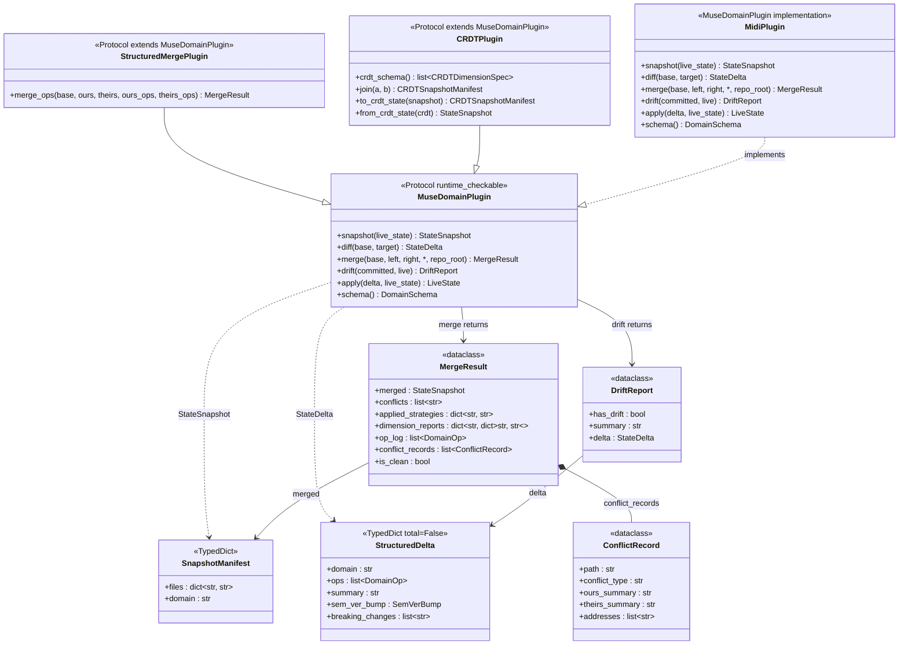

---

### Diagram 2 — DomainOp Discriminated Union

The typed operation algebra. `PatchOp` is recursive via `child_ops`.
`MutateOp` carries per-field deltas via `FieldMutation`.

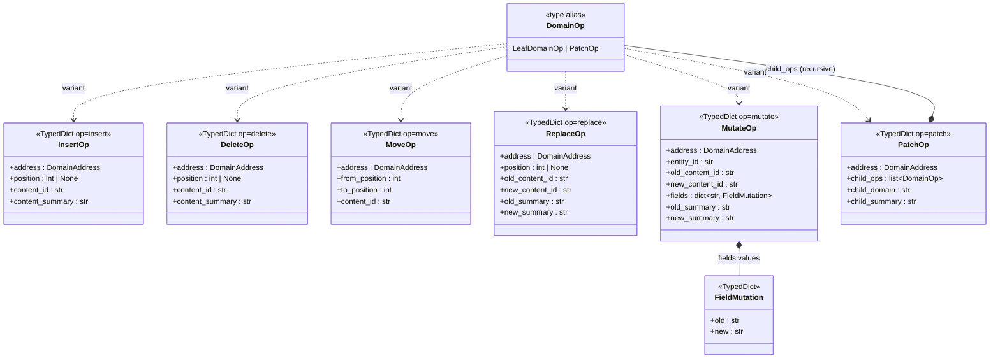

---

### Diagram 3 — Domain Schema and Diff Input Pairing

Each `ElementSchema` variant is paired with a `DiffInput` variant sharing
the same `kind` discriminator. `diff_by_schema()` uses this to dispatch to
the correct algorithm.

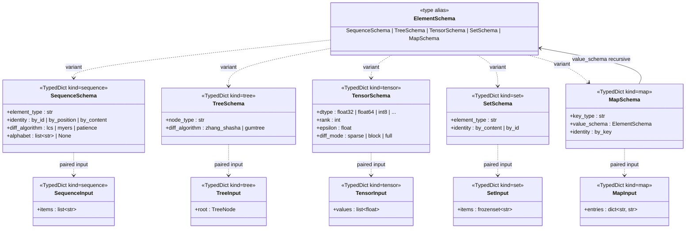

---

### Diagram 4 — CRDT Primitive Lattice

Each CRDT has a class with `join()` satisfying lattice laws and a wire-format
TypedDict for serialisation. All are used by `CRDTPlugin` and the CRDT annotation
fields in `CommitRecord`.

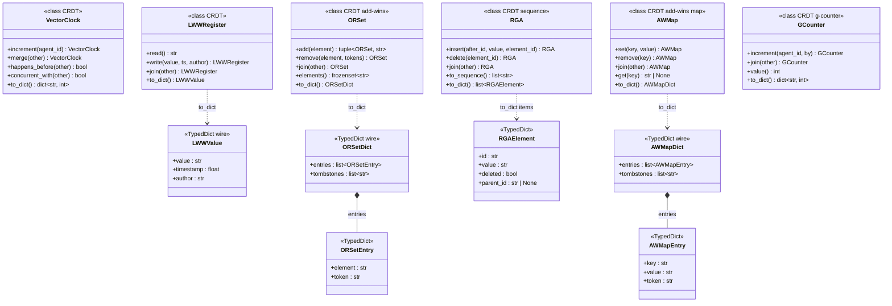

---

### Diagram 5 — Store Wire-Format and In-Memory Dataclasses

The two-layer design: wire-format `TypedDict`s for JSON serialisation, rich
`dataclass`es for in-memory logic. `CommitRecord` now carries agent provenance
and CRDT annotation fields.

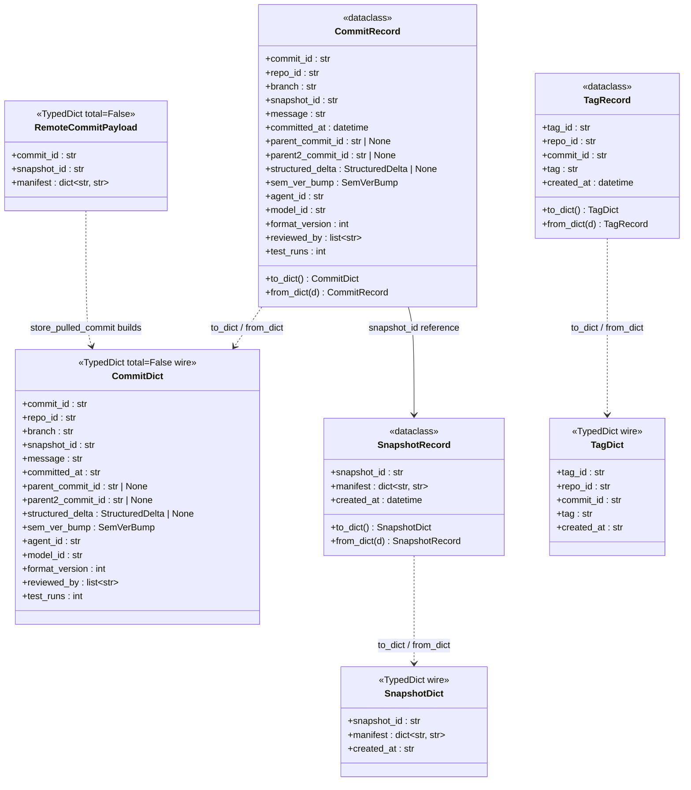

---

### Diagram 6 — Op Log Types

The op log records every domain operation in causal order. `OpEntry` carries a
`DomainOp`; `OpLog` accumulates entries and can fold them into a
`StructuredDelta`.

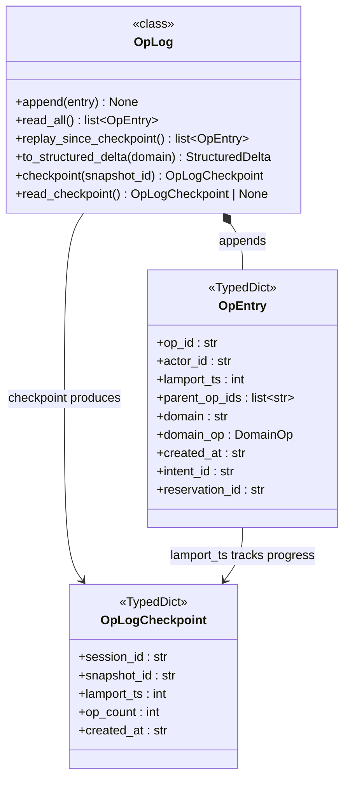

---

### Diagram 7 — Merge Engine State

The in-progress merge state written to disk on conflict and loaded on
continuation.

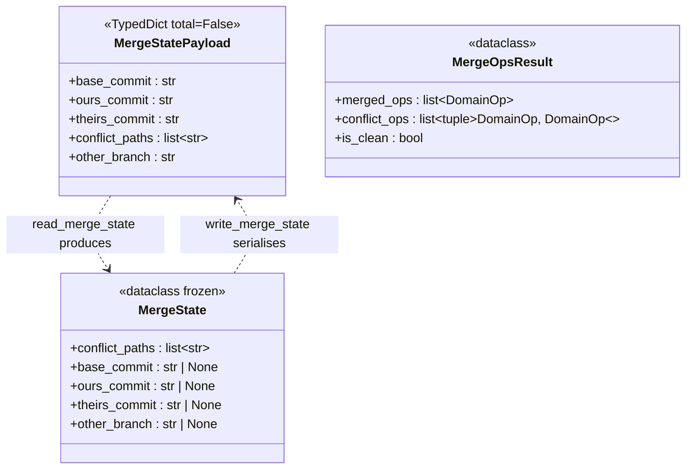

---

### Diagram 8 — Attributes and MIDI Dimension Merge

The `.museattributes` rule pipeline flowing into the 21-dimension MIDI merge
engine.

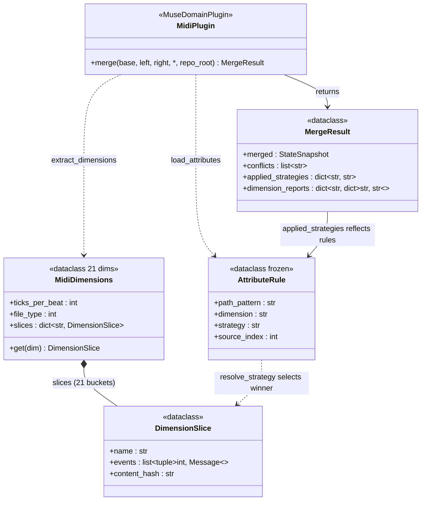

---

### Diagram 9 — Code Plugin Types

Symbol extraction pipeline for the code domain. `LanguageAdapter` is the
per-language abstraction; `PythonAdapter` and `TreeSitterAdapter` are the
concrete implementations.

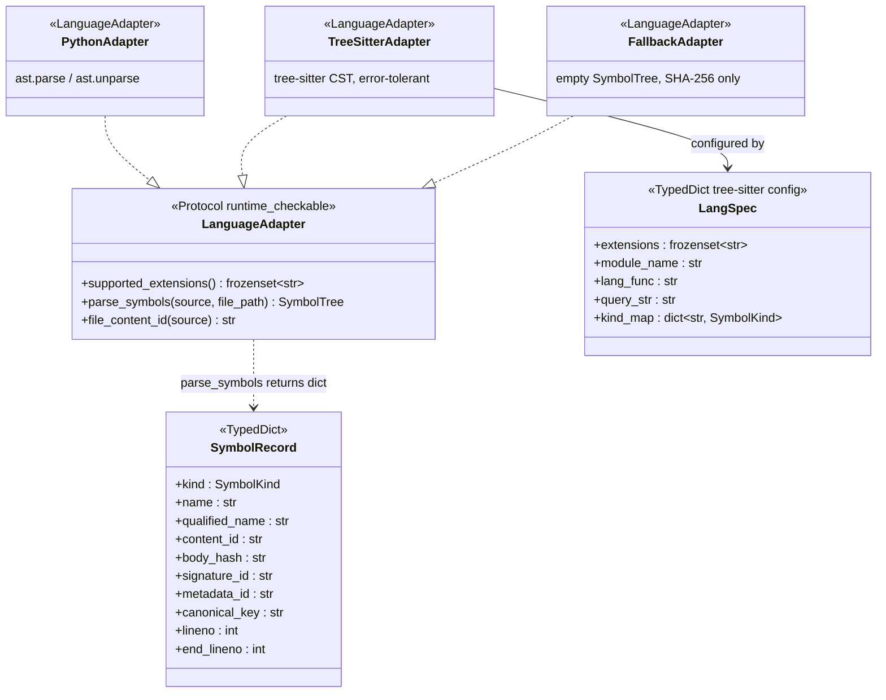

---

### Diagram 10 — Configuration, Import, Stash, and Errors

Supporting types for CLI infrastructure.

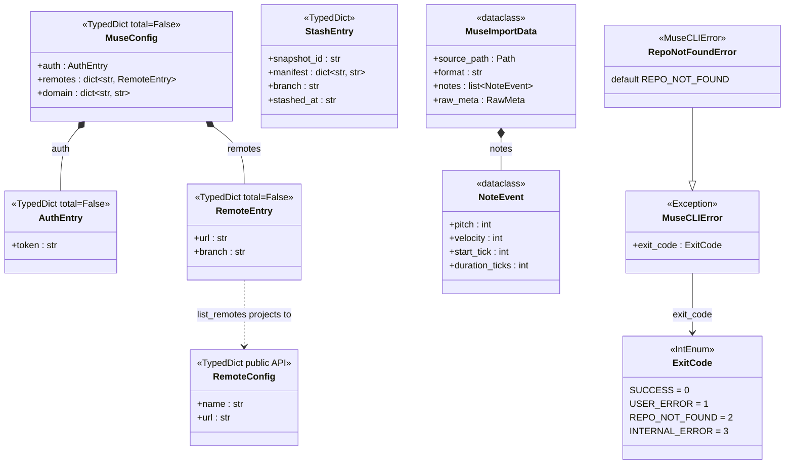

---

### Diagram 11 — Full Entity Dependency Overview

All named entities grouped by layer, showing the dependency flow from domain
protocol down through diff algorithms, CRDTs, store, and plugins.

```mermaid
classDiagram
    class MuseDomainPlugin {
        <<Protocol>>
        snapshot · diff · merge · drift · apply · schema
    }
    class StructuredDelta {
        <<TypedDict StateDelta>>
        domain · ops: list~DomainOp~ · sem_ver_bump
    }
    class SnapshotManifest {
        <<TypedDict StateSnapshot>>
        files: dict~str,str~ · domain
    }
    class MergeResult {
        <<dataclass>>
        merged · conflicts · op_log · conflict_records
    }
    class DomainOp {
        <<type alias>>
        Insert | Delete | Move | Replace | Mutate | Patch
    }
    class DomainSchema {
        <<TypedDict>>
        dimensions: list~DimensionSpec~ · top_level: ElementSchema
    }
    class CommitRecord {
        <<dataclass>>
        commit_id · structured_delta · sem_ver_bump · reviewed_by · test_runs
    }
    class SnapshotRecord {
        <<dataclass>>
        snapshot_id · manifest: dict~str,str~
    }
    class MergeState {
        <<dataclass frozen>>
        conflict_paths · base/ours/theirs commits
    }
    class OpEntry {
        <<TypedDict>>
        op_id · domain_op: DomainOp · lamport_ts
    }
    class GCounter {
        <<CRDT>>
        increment · join · value
    }
    class ORSet {
        <<CRDT add-wins>>
        add · remove · join · elements
    }
    class AttributeRule {
        <<dataclass frozen>>
        path_pattern · dimension · strategy
    }
    class MidiDimensions {
        <<dataclass>>
        slices: dict~str,DimensionSlice~
    }
    class SymbolRecord {
        <<TypedDict>>
        kind · content_id · body_hash · signature_id
    }

    MuseDomainPlugin ..> SnapshotManifest : StateSnapshot
    MuseDomainPlugin ..> StructuredDelta : StateDelta
    MuseDomainPlugin --> MergeResult : merge
    MuseDomainPlugin --> DomainSchema : schema
    StructuredDelta *-- DomainOp : ops
    OpEntry --> DomainOp : domain_op
    CommitRecord --> SnapshotRecord : snapshot_id
    CommitRecord --> StructuredDelta : structured_delta
    CommitRecord --> ORSet : reviewed_by uses
    CommitRecord --> GCounter : test_runs uses
    MergeState ..> CommitRecord : references commits
    AttributeRule ..> MidiDimensions : resolve_strategy selects slices
    SymbolRecord ..> DomainOp : drives code plugin ops
```
