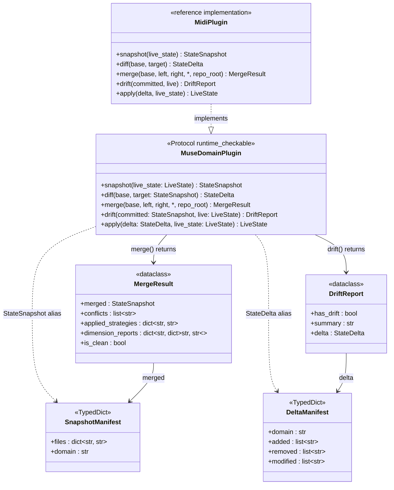
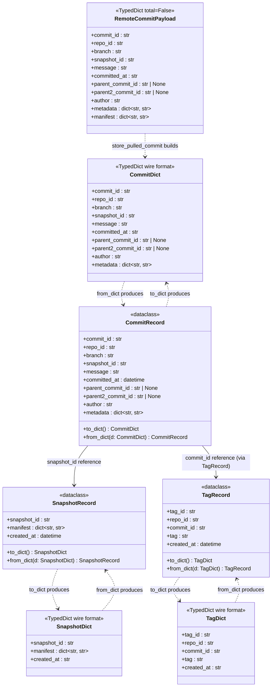
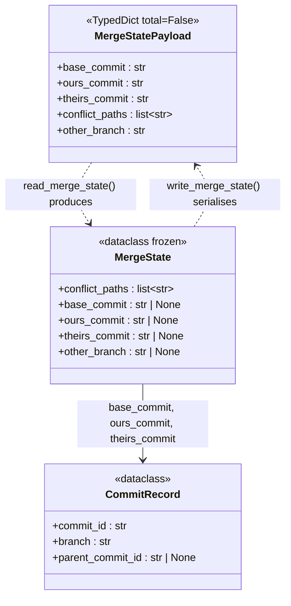
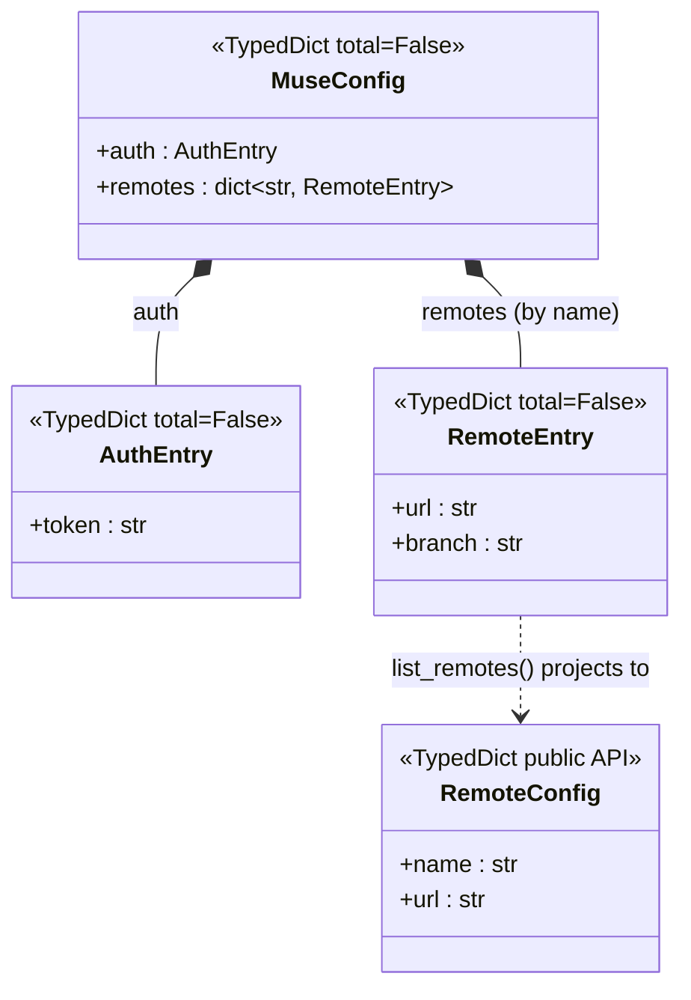
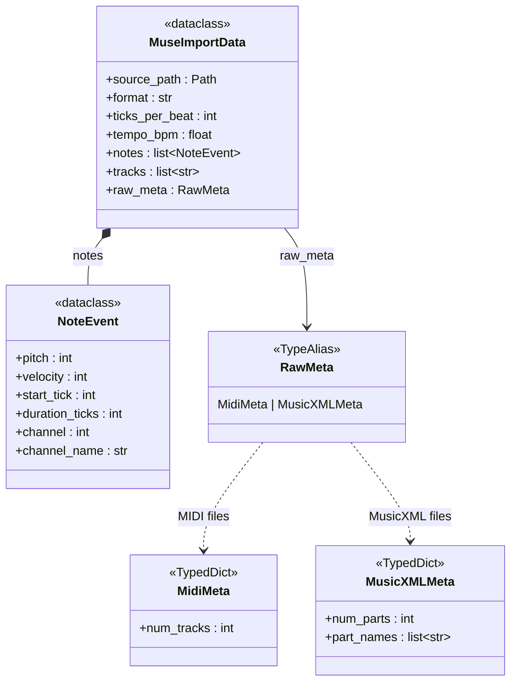
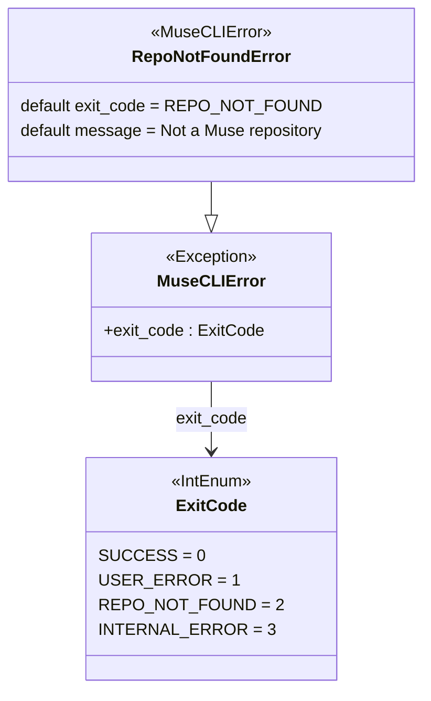
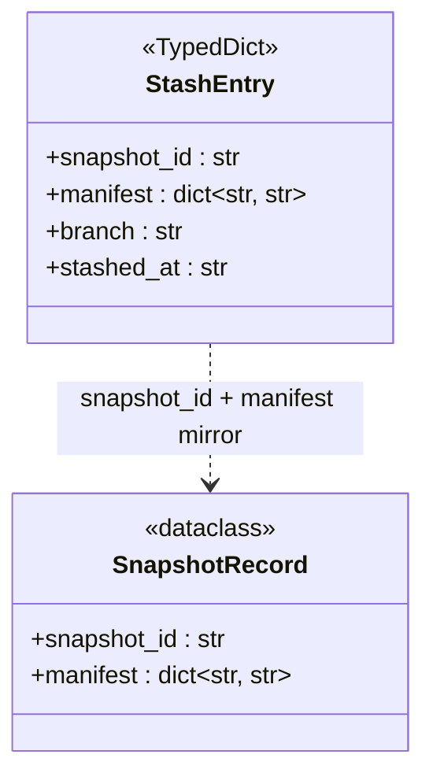
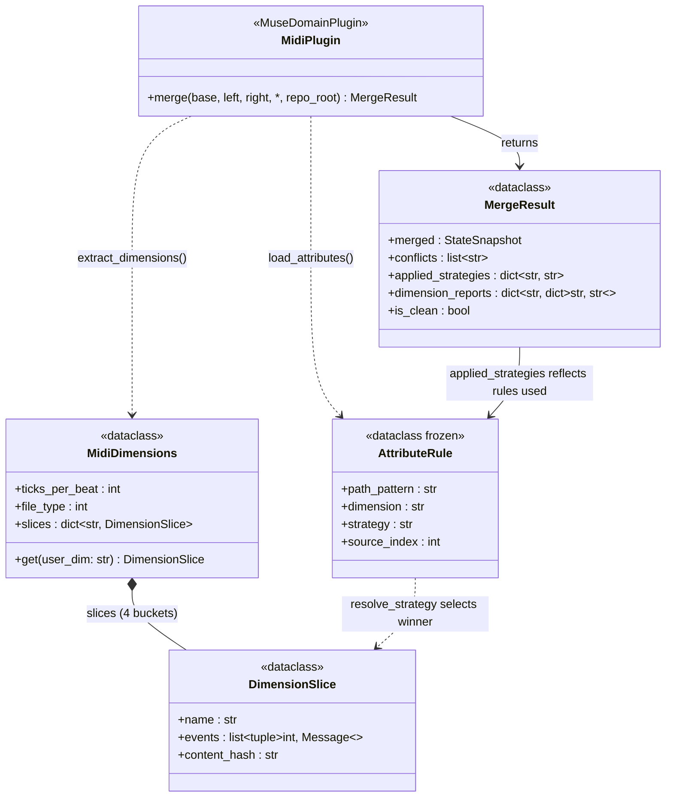

# Muse VCS — Type Contracts Reference

> Updated: 2026-03-17 (v0.1.1) | Reflects every named entity in the Muse VCS surface:
> domain protocol types, store wire-format TypedDicts, in-memory dataclasses,
> merge/config/stash types, MIDI import types, error hierarchy, and CLI enums.
> `Any` and `object` do not exist in any production file. Every type boundary
> is named. The typing audit ratchet enforces zero violations on every CI run.

This document is the single source of truth for every named entity —
`TypedDict`, `dataclass`, `Protocol`, `Enum`, `TypeAlias` — in the Muse
codebase. It covers the full contract of each type: fields, types,
optionality, and intended use.

---

## Table of Contents

1. [Design Philosophy](#design-philosophy)
2. [Domain Protocol Types (`muse/domain.py`)](#domain-protocol-types)
   - [Snapshot and Delta TypedDicts](#snapshot-and-delta-typeddicts)
   - [Typed Delta Algebra — StructuredDelta and DomainOp variants](#typed-delta-algebra)
   - [Type Aliases](#type-aliases)
   - [MergeResult and DriftReport Dataclasses](#mergeresult-and-driftreport-dataclasses)
   - [MuseDomainPlugin Protocol](#musedomainplugin-protocol)
   - [StructuredMergePlugin and CRDTPlugin Extensions](#optional-protocol-extensions)
   - [CRDT Types](#crdt-types)
3. [Domain Schema Types (`muse/core/schema.py`)](#domain-schema-types)
4. [OT Merge Types (`muse/core/op_transform.py`)](#ot-merge-types)
5. [Store Types (`muse/core/store.py`)](#store-types)
   - [Wire-Format TypedDicts](#wire-format-typeddicts)
   - [In-Memory Dataclasses](#in-memory-dataclasses)
6. [Merge Engine Types (`muse/core/merge_engine.py`)](#merge-engine-types)
7. [Attributes Types (`muse/core/attributes.py`)](#attributes-types)
8. [MIDI Dimension Merge Types (`muse/plugins/midi/midi_merge.py`)](#midi-dimension-merge-types)
9. [Configuration Types (`muse/cli/config.py`)](#configuration-types)
10. [MIDI / MusicXML Import Types (`muse/cli/midi_parser.py`)](#midi--musicxml-import-types)
11. [Stash Types (`muse/cli/commands/stash.py`)](#stash-types)
12. [Error Hierarchy (`muse/core/errors.py`)](#error-hierarchy)
13. [Entity Hierarchy](#entity-hierarchy)
14. [Entity Graphs (Mermaid)](#entity-graphs-mermaid)

---

## Design Philosophy

Every entity in this codebase follows five rules:

1. **No `Any`. No `object`. Ever.** Both collapse type safety for downstream
   callers. Every boundary is typed with a concrete named entity — `TypedDict`,
   `dataclass`, `Protocol`, or a specific union. The CI typing audit enforces
   this with a ratchet of zero violations.

2. **No covariance in collection aliases.** `dict[str, str]` and
   `list[str]` are used directly. If a function's return mixes value types,
   create a `TypedDict` for that shape instead of using `dict[str, str | int]`.

3. **Boundaries own coercion.** When external data arrives (JSON from disk,
   TOML from config, MIDI bytes from disk), the boundary module coerces it
   to the canonical internal type using `isinstance` narrowing. Downstream
   code always sees clean types.

4. **Wire-format TypedDicts for serialisation, dataclasses for in-memory
   logic.** `CommitDict`, `SnapshotDict`, `TagDict` are JSON-serialisable
   and used by `to_dict()` / `from_dict()`. `CommitRecord`, `SnapshotRecord`,
   `TagRecord` are rich dataclasses with typed `datetime` fields used in
   business logic.

5. **The plugin protocol is the extension point.** All domain-specific logic
   lives behind `MuseDomainPlugin`. The core DAG engine, branching, and
   merge machinery know nothing about music, genomics, or any other domain.
   Swapping domains is a one-file operation.

### What to use instead

| Banned | Use instead |
|--------|-------------|
| `Any` | `TypedDict`, `dataclass`, specific union |
| `object` | The actual type or a constrained union |
| `list` (bare) | `list[X]` with concrete element type |
| `dict` (bare) | `dict[K, V]` with concrete key/value types |
| `dict[str, X]` with known keys | `TypedDict` — name the keys |
| `Optional[X]` | `X \| None` |
| Legacy `List`, `Dict`, `Set`, `Tuple` | Lowercase builtins |
| `cast(T, x)` | Fix the callee to return `T` |
| `# type: ignore` | Fix the underlying type error |

---

## Domain Protocol Types

**Path:** `muse/domain.py`

The six-interface contract that every domain plugin must satisfy. The core
engine implements the DAG, branching, merge-base finding, and lineage walking.
A domain plugin provides the six methods and gets the full VCS for free.
Two optional protocol extensions (`StructuredMergePlugin`, `CRDTPlugin`) unlock
richer merge semantics.

### Snapshot and Delta TypedDicts

#### `SnapshotManifest`

`TypedDict` — Content-addressed snapshot of domain state. Used as the
canonical representation of a point-in-time capture. JSON-serialisable and
content-addressable via SHA-256.

| Field | Type | Description |
|-------|------|-------------|
| `files` | `dict[str, str]` | Workspace-relative POSIX paths → SHA-256 content digests |
| `domain` | `str` | Plugin identifier that produced this snapshot (e.g. `"music"`) |

**Example:**
```json
{
  "files": {
    "tracks/drums.mid": "a3f8...",
    "tracks/bass.mid":  "b291..."
  },
  "domain": "music"
}
```

### Typed Delta Algebra

#### `StructuredDelta`

`TypedDict` — The typed delta produced by `MuseDomainPlugin.diff()`. Replaces the
old `DeltaManifest` path-list format with a semantically rich operation list.

| Field | Type | Description |
|-------|------|-------------|
| `domain` | `str` | Plugin identifier that produced this delta |
| `ops` | `list[DomainOp]` | Ordered list of typed domain operations |
| `summary` | `str` | Human-readable summary (e.g. `"3 inserts, 1 delete"`) |

#### `DomainOp` — Five Variants

`DomainOp = InsertOp | DeleteOp | MoveOp | ReplaceOp | PatchOp`

Each variant is a `TypedDict` with an `"op"` discriminator and an `"address"`
identifying the element within the domain's namespace (e.g. `"note:4:60"` in
the MIDI domain).

| Variant | `op` | Additional fields | Description |
|---------|------|------------------|-------------|
| `InsertOp` | `"insert"` | `after_id: str \| None`, `content_id: str` | Insert an element after `after_id` (or at head if `None`) |
| `DeleteOp` | `"delete"` | `content_id: str` | Delete the element at `address` |
| `MoveOp` | `"move"` | `from_id: str`, `after_id: str \| None` | Move an element to a new position |
| `ReplaceOp` | `"replace"` | `old_content_id: str`, `new_content_id: str` | Atomic replace (old → new) |
| `PatchOp` | `"patch"` | `patch: dict[str, str]` | Partial field update; keys are field names, values are new content IDs |

`content_id` values are SHA-256 hex digests of the element's serialised
content, stored in the object store.

### Type Aliases

| Alias | Definition | Description |
|-------|-----------|-------------|
| `LiveState` | `SnapshotManifest \| pathlib.Path` | Current domain state — either an in-memory snapshot dict or a `muse-work/` directory path |
| `StateSnapshot` | `SnapshotManifest` | A content-addressed, immutable capture of state at a point in time |
| `StateDelta` | `StructuredDelta` | The typed delta between two snapshots |

`LiveState` carries two forms intentionally: the CLI path is used when commands
interact with the filesystem (`muse commit`, `muse status`); the snapshot form
is used when the engine constructs merges and diffs entirely in memory.

### MergeResult and DriftReport Dataclasses

#### `MergeResult`

`@dataclass` — Outcome of a three-way merge between two divergent state lines.
An empty `conflicts` list means the merge was clean.

| Field | Type | Default | Description |
|-------|------|---------|-------------|
| `merged` | `StateSnapshot` | required | The reconciled snapshot |
| `conflicts` | `list[str]` | `[]` | Workspace-relative paths that could not be auto-merged |
| `applied_strategies` | `dict[str, str]` | `{}` | Path → strategy applied by `.museattributes` (e.g. `{"drums/kick.mid": "ours"}`) |
| `dimension_reports` | `dict[str, dict[str, str]]` | `{}` | Path → per-dimension winner map; only populated for MIDI files that went through dimension-level merge (e.g. `{"keys/piano.mid": {"notes": "left", "pitch_bend": "right"}}`) |

**Property:**

| Name | Returns | Description |
|------|---------|-------------|
| `is_clean` | `bool` | `True` when `conflicts` is empty |

#### `DriftReport`

`@dataclass` — Gap between committed state and current live state. Produced by
`MuseDomainPlugin.drift()` and consumed by `muse status`.

| Field | Type | Default | Description |
|-------|------|---------|-------------|
| `has_drift` | `bool` | required | `True` when live state differs from committed snapshot |
| `summary` | `str` | `""` | Human-readable description (e.g. `"2 added, 1 modified"`) |
| `delta` | `StateDelta` | empty `DeltaManifest` | Machine-readable diff for programmatic consumers |

### MuseDomainPlugin Protocol

`@runtime_checkable Protocol` — The six interfaces a domain plugin must
implement. Runtime-checkable so that `assert isinstance(plugin, MuseDomainPlugin)`
works as a module-load sanity check.

| Method | Signature | Description |
|--------|-----------|-------------|
| `snapshot` | `(live_state: LiveState) -> StateSnapshot` | Capture current state as a content-addressed dict; must honour `.museignore` |
| `diff` | `(base: StateSnapshot, target: StateSnapshot, *, repo_root: pathlib.Path \| None = None) -> StateDelta` | Compute the typed delta between two snapshots |
| `merge` | `(base, left, right: StateSnapshot, *, repo_root: pathlib.Path \| None = None) -> MergeResult` | Three-way merge; when `repo_root` is provided, load `.museattributes` and perform dimension-level merge for supported formats |
| `drift` | `(committed: StateSnapshot, live: LiveState) -> DriftReport` | Compare committed state vs current live state |
| `apply` | `(delta: StateDelta, live_state: LiveState) -> LiveState` | Apply a delta to produce a new live state |
| `schema` | `() -> DomainSchema` | Declare the structural shape of the domain's data (drives diff algorithm selection) |

The music plugin (`muse.plugins.midi.plugin`) is the reference implementation.
Every other domain — scientific simulation, genomics, 3D spatial design,
spacetime — implements these six methods and registers itself as a plugin.

### Optional Protocol Extensions

#### `StructuredMergePlugin`

`@runtime_checkable Protocol` — Extends `MuseDomainPlugin` with operation-level
OT merge. When both branches produce `StructuredDelta`s, the merge engine detects
`isinstance(plugin, StructuredMergePlugin)` and calls `merge_ops()` instead of
`merge()`.

| Method | Signature | Description |
|--------|-----------|-------------|
| `merge_ops` | `(base, ours_snap, theirs_snap, ours_ops, theirs_ops, *, repo_root) -> MergeResult` | Operation-level three-way merge using OT commutativity rules |

#### `CRDTPlugin`

`@runtime_checkable Protocol` — Extends `MuseDomainPlugin` with convergent merge.
`join` always succeeds — no conflict state ever exists.

| Method | Signature | Description |
|--------|-----------|-------------|
| `join` | `(a: CRDTSnapshotManifest, b: CRDTSnapshotManifest) -> CRDTSnapshotManifest` | Convergent join satisfying commutativity, associativity, idempotency |
| `crdt_schema` | `() -> list[CRDTDimensionSpec]` | Per-dimension CRDT primitive specification |
| `to_crdt_state` | `(snapshot: StateSnapshot) -> CRDTSnapshotManifest` | Convert a snapshot into CRDT state |
| `from_crdt_state` | `(crdt: CRDTSnapshotManifest) -> StateSnapshot` | Convert CRDT state back to a plain snapshot |

### CRDT Types

#### `CRDTSnapshotManifest`

`TypedDict` — Extended snapshot format for CRDT-mode plugins. Wraps the plain
snapshot manifest with a vector clock and serialised CRDT state.

| Field | Type | Description |
|-------|------|-------------|
| `schema_version` | `int` | Always `1` |
| `domain` | `str` | Plugin domain name |
| `files` | `dict[str, str]` | POSIX path → SHA-256 object digest (same as `SnapshotManifest`) |
| `vclock` | `dict[str, int]` | Vector clock: agent ID → logical clock value |
| `crdt_state` | `dict[str, str]` | Dimension name → serialised CRDT primitive state (JSON-encoded) |

#### `CRDTDimensionSpec`

`TypedDict` — Declares which CRDT primitive a dimension uses.

| Field | Type | Description |
|-------|------|-------------|
| `name` | `str` | Dimension name (must match a `DimensionSpec.name` in the plugin's `DomainSchema`) |
| `crdt_type` | `str` | One of: `"lww_register"`, `"or_set"`, `"rga"`, `"aw_map"`, `"g_counter"`, `"vector_clock"` |

---

## Domain Schema Types

**Path:** `muse/core/schema.py`

The `DomainSchema` family of TypedDicts allow a plugin to declare its data
structure. The core engine uses this to select diff algorithms per-dimension
and to drive informed conflict reporting during OT merge.

#### `ElementSchema`

`TypedDict` — The schema for a single element kind (a top-level data entity).

| Field | Type | Description |
|-------|------|-------------|
| `name` | `str` | Element kind name (e.g. `"note"`, `"track"`, `"gene_edit"`) |
| `kind` | `str` | Container kind: `"sequence"`, `"set"`, `"map"`, or `"scalar"` |

#### `DimensionSpec`

`TypedDict` — Schema for a single orthogonal dimension within the domain.

| Field | Type | Description |
|-------|------|-------------|
| `name` | `str` | Dimension name (e.g. `"notes"`, `"pitch_bend"`) |
| `description` | `str` | Human-readable description for this dimension |
| `diff_algorithm` | `str` | Algorithm to use: `"myers_lcs"`, `"tree_edit"`, `"numerical"`, or `"set_ops"` |

#### `CRDTDimensionSpec`

`TypedDict` — Schema for a dimension using CRDT convergent merge semantics.
See [CRDT Types](#crdt-types) above for the `crdt_type` values.

#### `MapSchema`

`TypedDict` — Schema for a map-kind element's value type.

| Field | Type | Description |
|-------|------|-------------|
| `value_schema` | `ElementSchema` | Schema of the map's values |

#### `DomainSchema`

`TypedDict` — The top-level schema declaration returned by `MuseDomainPlugin.schema()`.

| Field | Type | Description |
|-------|------|-------------|
| `domain` | `str` | Plugin domain name |
| `schema_version` | `int` | Always `1` |
| `description` | `str` | Human-readable domain description |
| `merge_mode` | `str` | `"three_way"` (OT merge) or `"crdt"` (convergent join) |
| `elements` | `list[ElementSchema]` | Top-level element kind declarations |
| `dimensions` | `list[DimensionSpec \| CRDTDimensionSpec]` | Orthogonal dimension declarations |

---

## OT Merge Types

**Path:** `muse/core/op_transform.py`

Operational Transformation types for the `StructuredMergePlugin` extension.

#### `MergeOpsResult`

`@dataclass` — Result of `merge_op_lists()`. Carries auto-merged ops and any
unresolvable conflicts as pairs.

| Field | Type | Description |
|-------|------|-------------|
| `merged_ops` | `list[DomainOp]` | Operations that were auto-merged (commuting ops from both branches) |
| `conflict_ops` | `list[tuple[DomainOp, DomainOp]]` | Pairs of non-commuting operations: `(our_op, their_op)` |

**Lattice contract:** `merged_ops` contains every auto-merged op exactly once;
`conflict_ops` contains every unresolvable pair exactly once.

---

## Store Types

**Path:** `muse/core/store.py`

All commit and snapshot metadata is stored as JSON files under `.muse/`.
Wire-format `TypedDict`s are the JSON-serialisable shapes used in `to_dict()`
and `from_dict()`. In-memory `dataclass`es are the rich representations used
in business logic throughout the CLI commands.

### Wire-Format TypedDicts

These types appear at the boundary between Python objects and JSON on disk.
`json.loads()` returns an untyped result; `from_dict()` methods consume it and
return typed dataclasses. `to_dict()` methods produce these TypedDicts for
`json.dumps()`.

#### `CommitDict`

`TypedDict` — JSON-serialisable representation of a commit record. All datetime
values are ISO-8601 strings; callers convert to `datetime` inside `from_dict()`.

| Field | Type | Description |
|-------|------|-------------|
| `commit_id` | `str` | SHA-256 hex digest of the commit's canonical inputs |
| `repo_id` | `str` | UUID identifying the repository |
| `branch` | `str` | Branch name at time of commit |
| `snapshot_id` | `str` | SHA-256 hex digest of the attached snapshot |
| `message` | `str` | Commit message |
| `committed_at` | `str` | ISO-8601 UTC timestamp |
| `parent_commit_id` | `str \| None` | First parent commit ID; `None` for initial commit |
| `parent2_commit_id` | `str \| None` | Second parent commit ID; non-`None` only for merge commits |
| `author` | `str` | Author name string |
| `metadata` | `dict[str, str]` | Extensible string→string metadata bag |

#### `SnapshotDict`

`TypedDict` — JSON-serialisable representation of a snapshot record.

| Field | Type | Description |
|-------|------|-------------|
| `snapshot_id` | `str` | SHA-256 hex digest of the manifest |
| `manifest` | `dict[str, str]` | POSIX path → SHA-256 object digest |
| `created_at` | `str` | ISO-8601 UTC timestamp |

#### `TagDict`

`TypedDict` — JSON-serialisable representation of a semantic tag.

| Field | Type | Description |
|-------|------|-------------|
| `tag_id` | `str` | UUID identifying the tag |
| `repo_id` | `str` | UUID identifying the repository |
| `commit_id` | `str` | SHA-256 commit ID this tag points to |
| `tag` | `str` | Tag name string (e.g. `"v1.0"`) |
| `created_at` | `str` | ISO-8601 UTC timestamp |

#### `RemoteCommitPayload`

`TypedDict (total=False)` — Wire format received from a remote during push/pull.
All fields are optional because the remote payload may omit fields unknown to
older protocol versions. Callers validate required fields before constructing
a `CommitRecord`.

| Field | Type | Description |
|-------|------|-------------|
| `commit_id` | `str` | Commit identifier |
| `repo_id` | `str` | Repository UUID |
| `branch` | `str` | Branch name |
| `snapshot_id` | `str` | Snapshot identifier |
| `message` | `str` | Commit message |
| `committed_at` | `str` | ISO-8601 timestamp |
| `parent_commit_id` | `str \| None` | First parent |
| `parent2_commit_id` | `str \| None` | Second parent (merge commits) |
| `author` | `str` | Author name |
| `metadata` | `dict[str, str]` | Metadata bag |
| `manifest` | `dict[str, str]` | Inline snapshot manifest (remote optimisation) |

### In-Memory Dataclasses

These rich types are constructed from wire-format TypedDicts after loading from
disk. They carry typed `datetime` values and are used throughout CLI command
implementations.

#### `CommitRecord`

`@dataclass` — In-memory representation of a commit.

| Field | Type | Default | Description |
|-------|------|---------|-------------|
| `commit_id` | `str` | required | SHA-256 hex digest |
| `repo_id` | `str` | required | Repository UUID |
| `branch` | `str` | required | Branch name |
| `snapshot_id` | `str` | required | Attached snapshot digest |
| `message` | `str` | required | Commit message |
| `committed_at` | `datetime.datetime` | required | UTC commit timestamp |
| `parent_commit_id` | `str \| None` | `None` | First parent; `None` for root commits |
| `parent2_commit_id` | `str \| None` | `None` | Second parent for merge commits |
| `author` | `str` | `""` | Author name |
| `metadata` | `dict[str, str]` | `{}` | Extensible string→string metadata |

**Methods:**

| Method | Returns | Description |
|--------|---------|-------------|
| `to_dict()` | `CommitDict` | Serialise to JSON-ready TypedDict |
| `from_dict(d: CommitDict)` | `CommitRecord` | Deserialise from JSON-loaded TypedDict |

#### `SnapshotRecord`

`@dataclass` — In-memory representation of a content-addressed snapshot.

| Field | Type | Default | Description |
|-------|------|---------|-------------|
| `snapshot_id` | `str` | required | SHA-256 hex digest of the manifest |
| `manifest` | `dict[str, str]` | required | POSIX path → SHA-256 object digest |
| `created_at` | `datetime.datetime` | UTC now | Creation timestamp |

**Methods:** `to_dict() -> SnapshotDict`, `from_dict(d: SnapshotDict) -> SnapshotRecord`

#### `TagRecord`

`@dataclass` — In-memory representation of a semantic tag.

| Field | Type | Default | Description |
|-------|------|---------|-------------|
| `tag_id` | `str` | required | UUID |
| `repo_id` | `str` | required | Repository UUID |
| `commit_id` | `str` | required | Tagged commit's SHA-256 digest |
| `tag` | `str` | required | Tag name |
| `created_at` | `datetime.datetime` | UTC now | Creation timestamp |

**Methods:** `to_dict() -> TagDict`, `from_dict(d: TagDict) -> TagRecord`

---

## Merge Engine Types

**Path:** `muse/core/merge_engine.py`

#### `MergeStatePayload`

`TypedDict (total=False)` — JSON-serialisable form of an in-progress merge
state. Written to `.muse/MERGE_STATE.json` when a merge has unresolved
conflicts. All fields are optional in the TypedDict because `other_branch` is
only set when the merge has a named second branch.

| Field | Type | Description |
|-------|------|-------------|
| `base_commit` | `str` | Common ancestor commit ID |
| `ours_commit` | `str` | Current branch HEAD at merge start |
| `theirs_commit` | `str` | Incoming branch HEAD at merge start |
| `conflict_paths` | `list[str]` | POSIX paths with unresolved conflicts |
| `other_branch` | `str` | Name of the branch being merged in (optional) |

#### `MergeState`

`@dataclass (frozen=True)` — Loaded in-memory representation of
`MERGE_STATE.json`. Immutable so it can be passed around without accidental
mutation.

| Field | Type | Default | Description |
|-------|------|---------|-------------|
| `conflict_paths` | `list[str]` | `[]` | Paths with unresolved conflicts |
| `base_commit` | `str \| None` | `None` | Common ancestor commit ID |
| `ours_commit` | `str \| None` | `None` | Our HEAD at merge start |
| `theirs_commit` | `str \| None` | `None` | Their HEAD at merge start |
| `other_branch` | `str \| None` | `None` | Name of the incoming branch |

---

## Attributes Types

**Path:** `muse/core/attributes.py`

Parse and resolve `.museattributes` TOML merge-strategy rules. The parser
produces a typed `AttributeRule` list; `resolve_strategy` does first-match
lookup with `fnmatch` path patterns and dimension name matching.

#### `VALID_STRATEGIES`

`frozenset[str]` — The set of legal strategy strings:
`{"ours", "theirs", "union", "auto", "manual"}`.

#### `AttributesMeta`

`TypedDict (total=False)` — The `[meta]` section of `.museattributes`.

| Field | Type | Description |
|-------|------|-------------|
| `domain` | `str` | Domain name this file targets (optional — validated against `.muse/repo.json` when present) |

#### `AttributesRuleDict`

`TypedDict` — A single `[[rules]]` entry as parsed from TOML.

| Field | Type | Description |
|-------|------|-------------|
| `path` | `str` | `fnmatch` glob matched against workspace-relative POSIX paths |
| `dimension` | `str` | Domain axis name (e.g. `"notes"`) or `"*"` to match all |
| `strategy` | `str` | One of the `VALID_STRATEGIES` strings |

#### `MuseAttributesFile`

`TypedDict (total=False)` — The complete `MuseAttributesFile` structure after TOML parsing.

| Field | Type | Description |
|-------|------|-------------|
| `meta` | `AttributesMeta` | Optional `[meta]` section |
| `rules` | `list[AttributesRuleDict]` | Ordered `[[rules]]` array |

#### `AttributeRule`

`@dataclass (frozen=True)` — A single resolved rule from `.museattributes`.

| Field | Type | Description |
|-------|------|-------------|
| `path_pattern` | `str` | `fnmatch` glob matched against workspace-relative POSIX paths |
| `dimension` | `str` | Domain axis name (e.g. `"notes"`, `"pitch_bend"`) or `"*"` to match all |
| `strategy` | `str` | One of the `VALID_STRATEGIES` strings |
| `source_index` | `int` | 0-based index of the rule in the `[[rules]]` array; defaults to `0` |

**Public functions:**

- `load_attributes(root: pathlib.Path, *, domain: str | None = None) -> list[AttributeRule]` —
  reads `.museattributes` TOML, validates domain if provided, returns rules in
  file order; raises `ValueError` for parse errors, missing fields, or invalid strategy.
- `read_attributes_meta(root: pathlib.Path) -> AttributesMeta` —
  returns the `[meta]` section only; returns `{}` if file is absent or unparseable.
- `resolve_strategy(rules: list[AttributeRule], path: str, dimension: str = "*") -> str` —
  first-match lookup; returns `"auto"` when no rule matches.

---

## MIDI Dimension Merge Types

**Path:** `muse/plugins/midi/midi_merge.py`

The multidimensional merge engine for the MIDI domain.  MIDI events are
bucketed into four orthogonal dimension slices; each slice has a content hash
for fast change detection.  A three-way merge resolves each dimension
independently using `.museattributes` strategies, then reconstructs a valid
MIDI file from the winning slices.

#### Constants

| Name | Type | Value / Description |
|------|------|---------------------|
| `INTERNAL_DIMS` | `list[str]` | `["notes", "pitch_bend", "cc_volume", "track_structure"]` — the internal dimension bucket names |
| `DIM_ALIAS` | `dict[str, str]` | Maps user-facing names to internal buckets: `"notes" → "notes"`, `"notes" → "notes"`, `"pitch_bend" → "pitch_bend"`, `"cc_volume" → "cc_volume"`, `"track_structure" → "track_structure"` |

#### `_MsgVal`

`TypeAlias = int | str | list[int]` — The set of value types that can appear
in the serialised form of a MIDI message field.  Used by `_msg_to_dict` to
avoid `dict[str, object]`.

#### `DimensionSlice`

`@dataclass` — All MIDI events belonging to one dimension of a parsed file.

| Field | Type | Default | Description |
|-------|------|---------|-------------|
| `name` | `str` | required | Internal dimension name (e.g. `"notes"`, `"pitch_bend"`) |
| `events` | `list[tuple[int, mido.Message]]` | `[]` | `(abs_tick, message)` pairs sorted by ascending absolute tick |
| `content_hash` | `str` | `""` | SHA-256 digest of the canonical JSON serialisation; computed in `__post_init__` when not provided |

#### `MidiDimensions`

`@dataclass` — All four dimension slices extracted from one MIDI file, plus
file-level metadata.

| Field | Type | Description |
|-------|------|-------------|
| `ticks_per_beat` | `int` | MIDI timing resolution (pulses per quarter note) from the source file |
| `file_type` | `int` | MIDI file type (0 = single-track, 1 = multi-track synchronous) |
| `slices` | `dict[str, DimensionSlice]` | Internal dimension name → slice |

**Method:**

| Name | Signature | Description |
|------|-----------|-------------|
| `get` | `(user_dim: str) -> DimensionSlice` | Resolve a user-facing alias (`"notes"`, `"notes"`) or internal name to the correct slice |

**Public functions:**

| Function | Signature | Description |
|----------|-----------|-------------|
| `extract_dimensions` | `(midi_bytes: bytes) -> MidiDimensions` | Parse MIDI bytes and bucket events by dimension |
| `dimension_conflict_detail` | `(base, left, right: MidiDimensions) -> dict[str, str]` | Per-dimension change report: `"unchanged"`, `"left_only"`, `"right_only"`, or `"both"` |
| `merge_midi_dimensions` | `(base_bytes, left_bytes, right_bytes: bytes, attrs_rules: list[AttributeRule], path: str) -> tuple[bytes, dict[str, str]] \| None` | Three-way dimension merge; returns `(merged_bytes, dimension_report)` or `None` on unresolvable conflict |

---

## Configuration Types

**Path:** `muse/cli/config.py`

The structured view of `.muse/config.toml`. Loading from TOML uses `isinstance`
narrowing from `tomllib`'s untyped output — no `Any` annotation is ever written
in source. All mutation functions read the current config, modify the specific
section, and write back.

#### `AuthEntry`

`TypedDict (total=False)` — `[auth]` section in `.muse/config.toml`.

| Field | Type | Description |
|-------|------|-------------|
| `token` | `str` | Bearer token for Muse Hub authentication. **Never logged.** |

#### `RemoteEntry`

`TypedDict (total=False)` — `[remotes.<name>]` section in `.muse/config.toml`.

| Field | Type | Description |
|-------|------|-------------|
| `url` | `str` | Remote Hub URL (e.g. `"https://hub.example.com/repos/my-repo"`) |
| `branch` | `str` | Upstream branch tracked by this remote (set by `--set-upstream`) |

#### `MuseConfig`

`TypedDict (total=False)` — Structured view of the entire `.muse/config.toml`
file. All sections are optional; an empty dict is a valid `MuseConfig`.

| Field | Type | Description |
|-------|------|-------------|
| `auth` | `AuthEntry` | Authentication credentials section |
| `remotes` | `dict[str, RemoteEntry]` | Named remote sections |
| `domain` | `dict[str, str]` | Domain-specific key/value pairs; keys are domain-defined (e.g. `ticks_per_beat` for music, `reference_assembly` for genomics). The core engine ignores this section; only the active plugin reads it. |

#### `RemoteConfig`

`TypedDict` — Public-facing remote descriptor returned by `list_remotes()`.
A lightweight projection of `RemoteEntry` that always has both required fields.

| Field | Type | Description |
|-------|------|-------------|
| `name` | `str` | Remote name (e.g. `"origin"`) |
| `url` | `str` | Remote URL |

---

## MIDI / MusicXML Import Types

**Path:** `muse/cli/midi_parser.py`

Types used by `muse import` to parse Standard MIDI Files and MusicXML documents
into Muse's internal note representation.

#### `MidiMeta`

`TypedDict` — Format-specific metadata for Standard MIDI Files (`.mid`, `.midi`).

| Field | Type | Description |
|-------|------|-------------|
| `num_tracks` | `int` | Number of MIDI tracks in the file |

#### `MusicXMLMeta`

`TypedDict` — Format-specific metadata for MusicXML files (`.xml`, `.musicxml`).

| Field | Type | Description |
|-------|------|-------------|
| `num_parts` | `int` | Number of parts (instruments) in the score |
| `part_names` | `list[str]` | Display names of each part |

#### `RawMeta`

`TypeAlias = MidiMeta | MusicXMLMeta` — Discriminated union of all
format-specific metadata shapes. The `MuseImportData.raw_meta` field carries
one of these two named types depending on the source file's format.

#### `NoteEvent`

`@dataclass` — A single sounding note extracted from an imported file.

| Field | Type | Description |
|-------|------|-------------|
| `pitch` | `int` | MIDI pitch number (0–127) |
| `velocity` | `int` | MIDI velocity (0–127; 0 = note-off) |
| `start_tick` | `int` | Onset tick relative to file start |
| `duration_ticks` | `int` | Note length in MIDI ticks |
| `channel` | `int` | MIDI channel (0–15) |
| `channel_name` | `str` | Track/part name for this channel |

#### `MuseImportData`

`@dataclass` — All data extracted from a single imported music file. The
complete parsed result returned by `parse_file()`.

| Field | Type | Description |
|-------|------|-------------|
| `source_path` | `pathlib.Path` | Absolute path to the source file |
| `format` | `str` | `"midi"` or `"musicxml"` |
| `ticks_per_beat` | `int` | MIDI timing resolution (pulses per quarter note) |
| `tempo_bpm` | `float` | Tempo in beats per minute |
| `notes` | `list[NoteEvent]` | All sounding notes, in onset order |
| `tracks` | `list[str]` | Track/part names present in the file |
| `raw_meta` | `RawMeta` | Format-specific metadata (`MidiMeta` or `MusicXMLMeta`) |

---

## Stash Types

**Path:** `muse/cli/commands/stash.py`

#### `StashEntry`

`TypedDict` — A single entry in the stash stack, persisted to
`.muse/stash.json` as one element of a JSON array.

| Field | Type | Description |
|-------|------|-------------|
| `snapshot_id` | `str` | SHA-256 content digest of the stashed snapshot |
| `manifest` | `dict[str, str]` | POSIX path → SHA-256 object digest of stashed files |
| `branch` | `str` | Branch name that was active when the stash was saved |
| `stashed_at` | `str` | ISO-8601 UTC timestamp of the stash operation |

---

## Error Hierarchy

**Path:** `muse/core/errors.py`

#### `ExitCode`

`IntEnum` — Standardised CLI exit codes. Used throughout the CLI commands via
`raise typer.Exit(code=ExitCode.USER_ERROR)`.

| Value | Integer | Meaning |
|-------|---------|---------|
| `SUCCESS` | `0` | Command completed successfully |
| `USER_ERROR` | `1` | Bad arguments or invalid user input |
| `REPO_NOT_FOUND` | `2` | Not inside a Muse repository |
| `INTERNAL_ERROR` | `3` | Unexpected internal failure |

#### `MuseCLIError`

`Exception` — Base exception for all Muse CLI errors. Carries an exit code
so that top-level handlers can produce the correct process exit.

| Field | Type | Description |
|-------|------|-------------|
| `exit_code` | `ExitCode` | Exit code to use when this exception terminates the process |

#### `RepoNotFoundError`

`MuseCLIError` — Raised by `find_repo_root()` callers when a command is invoked
outside a Muse repository. Default message: `"Not a Muse repository. Run muse init."` Default exit code: `ExitCode.REPO_NOT_FOUND`.

**Alias:** `MuseNotARepoError = RepoNotFoundError`

---

## Entity Hierarchy

```
Muse VCS
│
├── Domain Protocol (muse/domain.py)
│   │
│   ├── Snapshot and Delta
│   │   ├── SnapshotManifest       — TypedDict: {files: dict[str,str], domain: str}
│   │   └── DeltaManifest          — TypedDict: {domain, added, removed, modified}
│   │
│   ├── Type Aliases
│   │   ├── LiveState              — SnapshotManifest | pathlib.Path
│   │   ├── StateSnapshot          — SnapshotManifest
│   │   └── StateDelta             — DeltaManifest
│   │
│   ├── Result Types
│   │   ├── MergeResult            — dataclass: merged + conflicts + applied_strategies + dimension_reports
│   │   └── DriftReport            — dataclass: has_drift + summary + delta
│   │
│   └── MuseDomainPlugin           — Protocol (runtime_checkable): 6 methods
│                                    merge() accepts repo_root kwarg for attribute-aware merge
│
├── Store (muse/core/store.py)
│   │
│   ├── Wire-Format TypedDicts
│   │   ├── CommitDict             — TypedDict: all commit fields (str timestamps)
│   │   ├── SnapshotDict           — TypedDict: snapshot_id + manifest + created_at
│   │   ├── TagDict                — TypedDict: tag identity fields
│   │   └── RemoteCommitPayload    — TypedDict (total=False): wire format + manifest
│   │
│   └── In-Memory Dataclasses
│       ├── CommitRecord           — dataclass: typed datetime, to_dict/from_dict
│       ├── SnapshotRecord         — dataclass: manifest + datetime
│       └── TagRecord              — dataclass: tag metadata + datetime
│
├── Merge Engine (muse/core/merge_engine.py)
│   ├── MergeStatePayload          — TypedDict (total=False): MERGE_STATE.json shape
│   └── MergeState                 — dataclass (frozen): loaded in-memory merge state
│
├── Attributes (muse/core/attributes.py)
│   ├── VALID_STRATEGIES           — frozenset[str]: {ours, theirs, union, auto, manual}
│   ├── AttributesMeta             — TypedDict (total=False): [meta] section (domain: str)
│   ├── AttributesRuleDict         — TypedDict: [[rules]] entry (path, dimension, strategy)
│   ├── MuseAttributesFile         — TypedDict (total=False): full parsed file structure
│   └── AttributeRule              — dataclass (frozen): path_pattern + dimension + strategy + source_index
│
├── MIDI Dimension Merge (muse/plugins/midi/midi_merge.py)
│   ├── INTERNAL_DIMS              — list[str]: [all 21 MIDI dimensions]
│   ├── DIM_ALIAS                  — dict[str, str]: user-facing names → internal buckets
│   ├── _MsgVal                    — TypeAlias: int | str | list[int]
│   ├── DimensionSlice             — dataclass: name + events list + content_hash
│   └── MidiDimensions             — dataclass: ticks_per_beat + file_type + slices dict
│
├── Configuration (muse/cli/config.py)
│   ├── AuthEntry                  — TypedDict (total=False): [auth] section
│   ├── RemoteEntry                — TypedDict (total=False): [remotes.<name>] section
│   ├── MuseConfig                 — TypedDict (total=False): full config.toml shape (auth + remotes + domain)
│   └── RemoteConfig               — TypedDict: public remote descriptor
│
├── MIDI / MusicXML Import (muse/cli/midi_parser.py)
│   ├── MidiMeta                   — TypedDict: num_tracks
│   ├── MusicXMLMeta               — TypedDict: num_parts + part_names
│   ├── RawMeta                    — TypeAlias: MidiMeta | MusicXMLMeta
│   ├── NoteEvent                  — dataclass: pitch, velocity, timing, channel
│   └── MuseImportData             — dataclass: full parsed file result
│
├── Stash (muse/cli/commands/stash.py)
│   └── StashEntry                 — TypedDict: snapshot_id + manifest + branch + stashed_at
│
└── Errors (muse/core/errors.py)
    ├── ExitCode                   — IntEnum: SUCCESS=0 USER_ERROR=1 REPO_NOT_FOUND=2 INTERNAL_ERROR=3
    ├── MuseCLIError               — Exception base: carries ExitCode
    ├── RepoNotFoundError          — MuseCLIError: default exit REPO_NOT_FOUND
    └── MuseNotARepoError          — alias for RepoNotFoundError
```

---

## Entity Graphs (Mermaid)

Arrow conventions:
- `*--` composition (owns, lifecycle-coupled)
- `-->` association (references)
- `..>` dependency (uses)
- `..>` with label: produces / implements

---

### Diagram 1 — Domain Protocol and Plugin Contract

The `MuseDomainPlugin` protocol and the types that flow through its six methods. `MidiPlugin` is the reference implementation that proves the abstraction.



---

### Diagram 2 — Store Wire-Format TypedDicts and Dataclasses

The two-layer design: wire-format TypedDicts for JSON serialisation, rich
dataclasses for in-memory logic. Every `from_dict` consumes the TypedDict
shape produced by `json.loads()`; every `to_dict` produces it for
`json.dumps()`.



---

### Diagram 3 — Merge Engine State

The in-progress merge state written to disk on conflict and loaded on
continuation. `MergeStatePayload` is the JSON shape; `MergeState` is the
loaded, immutable in-memory form.



---

### Diagram 4 — Configuration Type Hierarchy

The structured config.toml types. `MuseConfig` is the root; mutation functions
read, modify a specific section, and write back. `isinstance` narrowing converts
`tomllib`'s untyped output to the typed structure at the load boundary.



---

### Diagram 5 — MIDI / MusicXML Import Types

The parser output types for `muse import`. `RawMeta` is a discriminated union
of two named shapes; no dict with mixed value types is exposed.



---

### Diagram 6 — Error Hierarchy

Exit codes, base exception, and concrete error types. Every CLI command raises
a typed exception or calls `raise typer.Exit(code=ExitCode.X)`.



---

### Diagram 7 — Stash Stack

The stash is a JSON array of `StashEntry` TypedDicts persisted to
`.muse/stash.json`. Push prepends; pop removes index 0.



---

### Diagram 8 — Full Entity Overview

All named entities grouped by layer, showing the dependency flow from the
domain protocol down through the store, CLI, and plugin layers.

```mermaid
classDiagram
    class MuseDomainPlugin {
        <<Protocol>>
        snapshot / diff / merge / drift / apply / schema
    }
    class SnapshotManifest {
        <<TypedDict>>
        files: dict~str,str~ · domain: str
    }
    class DeltaManifest {
        <<TypedDict>>
        domain · added · removed · modified
    }
    class MergeResult {
        <<dataclass>>
        merged · conflicts · applied_strategies · dimension_reports
    }
    class DriftReport {
        <<dataclass>>
        has_drift · summary · delta
    }
    class CommitRecord {
        <<dataclass>>
        commit_id · branch · snapshot_id · metadata
    }
    class SnapshotRecord {
        <<dataclass>>
        snapshot_id · manifest: dict~str,str~
    }
    class TagRecord {
        <<dataclass>>
        tag_id · commit_id · tag
    }
    class CommitDict {
        <<TypedDict wire>>
        all str fields · committed_at: str
    }
    class SnapshotDict {
        <<TypedDict wire>>
        snapshot_id · manifest · created_at
    }
    class TagDict {
        <<TypedDict wire>>
        tag_id · repo_id · commit_id · tag
    }
    class RemoteCommitPayload {
        <<TypedDict total=False>>
        wire format + manifest
    }
    class MergeState {
        <<dataclass frozen>>
        conflict_paths · base/ours/theirs commits
    }
    class MergeStatePayload {
        <<TypedDict total=False>>
        MERGE_STATE.json shape
    }
    class MuseConfig {
        <<TypedDict total=False>>
        auth · remotes
    }
    class AuthEntry {
        <<TypedDict total=False>>
        token: str
    }
    class RemoteEntry {
        <<TypedDict total=False>>
        url · branch
    }
    class RemoteConfig {
        <<TypedDict>>
        name · url
    }
    class StashEntry {
        <<TypedDict>>
        snapshot_id · manifest · branch · stashed_at
    }
    class MuseImportData {
        <<dataclass>>
        notes · tracks · raw_meta
    }
    class NoteEvent {
        <<dataclass>>
        pitch · velocity · timing · channel
    }
    class MidiMeta {
        <<TypedDict>>
        num_tracks: int
    }
    class MusicXMLMeta {
        <<TypedDict>>
        num_parts · part_names
    }
    class AttributeRule {
        <<dataclass frozen>>
        path_pattern · dimension · strategy
    }
    class DimensionSlice {
        <<dataclass>>
        name · events · content_hash
    }
    class MidiDimensions {
        <<dataclass>>
        ticks_per_beat · slices: dict~str, DimensionSlice~
    }
    class ExitCode {
        <<IntEnum>>
        SUCCESS=0 · USER_ERROR=1 · REPO_NOT_FOUND=2 · INTERNAL_ERROR=3
    }
    class MuseCLIError {
        <<Exception>>
        exit_code: ExitCode
    }
    class RepoNotFoundError {
        <<MuseCLIError>>
    }

    MuseDomainPlugin ..> SnapshotManifest : StateSnapshot
    MuseDomainPlugin ..> DeltaManifest : StateDelta
    MuseDomainPlugin --> MergeResult : merge() returns
    MuseDomainPlugin --> DriftReport : drift() returns
    MergeResult --> SnapshotManifest : merged
    DriftReport --> DeltaManifest : delta

    CommitRecord ..> CommitDict : to_dict / from_dict
    SnapshotRecord ..> SnapshotDict : to_dict / from_dict
    TagRecord ..> TagDict : to_dict / from_dict
    RemoteCommitPayload ..> CommitDict : store_pulled_commit
    CommitRecord --> SnapshotRecord : snapshot_id
    MergeState ..> MergeStatePayload : serialise / deserialise

    MuseConfig *-- AuthEntry : auth
    MuseConfig *-- RemoteEntry : remotes
    RemoteEntry ..> RemoteConfig : list_remotes()

    StashEntry ..> SnapshotRecord : snapshot_id
    MuseImportData *-- NoteEvent : notes
    MuseImportData --> MidiMeta : raw_meta (MIDI)
    MuseImportData --> MusicXMLMeta : raw_meta (XML)

    AttributeRule ..> MergeResult : applied_strategies reflects
    MidiDimensions *-- DimensionSlice : slices
    MidiDimensions ..> MergeResult : dimension_reports reflects

    RepoNotFoundError --|> MuseCLIError
    MuseCLIError --> ExitCode : exit_code
```



---

### Diagram 9 — Attributes and MIDI Dimension Merge

The attribute rule pipeline and how it flows into the multidimensional MIDI
merge engine.  `AttributeRule` objects are produced by `load_attributes()` and
consumed by both `MidiPlugin.merge()` and `merge_midi_dimensions()`.
`DimensionSlice` is the core bucket type; `MidiDimensions` groups the four
slices for one file.


